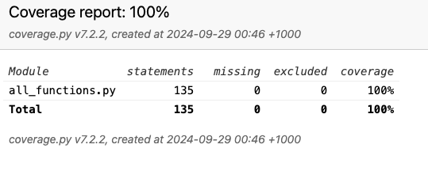

# Coverage Testing Report

Please provide your GitHub repository link.
### GitHub Repository URL: https://github.com/Josh-Wagner1/Milestone1_Group59

---

## 1. **Test Summary**

| **Tested Functions** |
|----------------------|
| `load_data(file_path)`         | 
| `filter_food_by_name(food_name, data)`      |
| `filter_food_by_exact_name(food_name, data)`   |
|`nutrition_breakdown(food_name, data, nutrients)`|
|`calculate_nutrients(food_name, data, weight_input, nutrients)`|
|`nutrition_range_filter(nutrient_input, nutrient_min_input, nutrient_max_input, data)`|
|`nutrition_filter_min_max(level)`|
|`nutrition_level_filter(nutrient_input, nutrient_level, data)`|

---

## 2. **Statement Coverage Test**

### 2.1 Description

To achieve 100% statement coverage, the test cases in test_all_functions.py were designed to execute every line of code in each function. This included:

- Testing all possible valid inputs to ensure all normal execution paths are covered.
- Testing invalid inputs to trigger all exception handling code blocks.
- Verifying edge cases such as empty strings, non-numeric inputs, and unexpected data types.
- These strategies ensured that every statement in each function was executed at least once during testing.

### 2.2 Testing Results
Below is a screenshot of the statement coverage report, demonstrating that 100% of the statements were covered:

## 3. **Branch Coverage Test**

### 3.1 Description

To achieve 100% branch coverage, the test cases were designed to ensure that every possible branch (true and false) of all conditional statements was executed. This was achieved by:

- Providing inputs that satisfy each conditional path, including edge cases.
- Testing exception handling by providing invalid inputs to trigger error branches.
- Ensuring that every if, elif, and else statement was evaluated in both positive and negative scenarios.

### 3.2 Testing Results
Below is a screenshot of the branch coverage report, demonstrating that 100% of the branches were covered:

