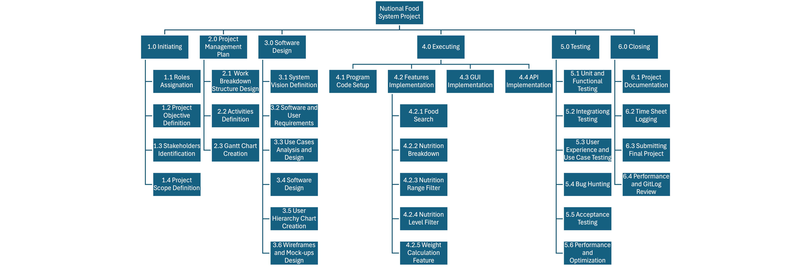

# Project Plan

## Project Name: Nutritional Food - Assignment.
## Group Number: 59

### Team members

|Student No. |   Full Name   | GitHub Username | Contribution (sum to 100%) | 
|------------|---------------|-----------------|----------------------------|
| s5280075   | Juan Martinez | juanjosemm2703  | 33.3% or Equal             |
| s5384766   | Joshua Wagner | Josh-Wagner1    | 33.3% or Equal             | 
| s5277614   | Gemma Manns   | gemmamanns      | 33.3% or Equal             | 

### Brief Description of Contribution

Please Describe what you have accomplished in this group project.
- s5384766, Joshua Wagner
  - Accomplishments: Completed the Activity Estimation Definition Estimation table (3) for the Project Plan and completed section 2 and 3.2 from the Software Design Document.
- s222222, Full name
  - Accomplishments: Describe what you have completed or achieved
- s333333, full name
  - Accomplishments: Describe what you have completed or achieved

# Table of Contents

* [Project Plan](#project-plan)
  * [1. Project Overview](#1-project-overview)
    * [1.1 Project Objectives](#11-project-objectives)
    * [1.2 Project Stakeholders](#12-project-stakeholders)
    * [1.3 Project Scope](#13-project-scope)
  * [2. Work Breakdown Structure](#2-work-breakdown-structure)
  * [3. Activity Definition Estimation](#3-activity-definition-estimation)
  * [4. Gantt Chart](#4-gantt-chart)

## 1. Project Overview

### 1.1 Project Objectives

### Project Objective:

The objective of this project is to develop a data analysis and visualization tool for the Comprehensive Nutritional Food Database. The tool will enable users to efficiently search for foods and view detailed nutritional information, visualize nutrient breakdowns, filter foods based on nutritional content ranges and levels and calculate nutritional information based on weight. The goal is to provide a tool with an easily interactable graphical interface for analyzing and understanding nutritional data and display the data through both text and graphics. 

Notes: 

Establish objectives or goals that the project aims to achieve.

* Food search, Nutrition breakdown, Nutrition Range filter and ???
  * selecting multiple foods and displaying the combined nutritional information 
  * having a calculator where you go input the weight of the food in grams and display the nutritional information.
  * Retrieve specific nutritional stats from a food and determine the amount required for a meal/ daily intake
The dataset includes specific features that your user interface must enable a user
  * Easily interactable interface
  * Reduce the number of steps to obtain the required information
  * Data is clearly conveyed through both text and graphs.

The data usable and applicable to the average user's dietry requirements.

### 1.2 Project Stakeholders 

The development of the data analysis and visualisation tool for the Comprehensive Nutritional Food Database involves a range of stakeholders. These stakeholders include internal teams responsible for the design, development, and deployment of the tool, as well as external parties who will influence or use the final product. Each stakeholder group has a specific role in shaping the tool's functionality and ensuring it meets the necessary standards. Below is a list of the key stakeholders, categorised by their roles in the project.

#### Internal Stakeholders

* Management/Client: Responsible for overseeing and approving the project and ensuring alignment with organisational goals.
* Project Managers: Oversee the project's progress, ensuring timelines and budgets are met.
* Programmers: Develop the back-end functionality and ensure the tool works as intended.
* User Interface Designers: Design the graphical user interface to ensure ease of use and accessibility.
* Quality Assurance: Test the tool to ensure it meets all requirements and is free of bugs.
* Cybersecurity Specialists: Ensure the tool is secure and compliant with data protection standards.
* Data Analysts: Analyze the nutritional data to ensure accurate representation and functionality within the tool.
* Database Administrators: Manage and optimise the nutritional database, ensuring its integration with the tool.
* Business Analysts: Gather requirements, perform market analysis, and ensure the tool aligns with user needs and business objectives.

#### External Stakeholders: 

* Government Bodies: May provide guidelines or regulations regarding nutritional data representation and user privacy.
* End Users

Notes: 
Identify all key stakeholders involved in the project, including internal teams and potential end-users.

Executive internal stakeholders:
* Management/Client: Responsible for overseeing the project and ensuring alignment with organizational goals.

Internal operational stakeholders:
* Project Managers: Oversee the project's progress, ensuring timelines and budgets are met.
* Programmers: Develop the back-end functionality and ensure the tool works as intended.
* User Interface Designers: Design the graphical user interface to ensure ease of use and accessibility.
* Quality Assurance: Test the tool to ensure it meets all requirements and is free of bugs.
* Cybersecurity Specialists: Ensure the tool is secure and compliant with data protection standards.
* Data Analysts: Analyze the nutritional data to ensure accurate representation and functionality within the tool.
* Database Administrators: Manage and optimize the nutritional database, ensuring its integration with the tool.
* Business Analysts: Gather requirements, perform market analysis, and ensure the tool aligns with user needs and business objectives.

External executive stakeholders:
* Government Bodies: May provide guidelines or regulations regarding nutritional data representation and user privacy.

External operational stakeholders:
* Sports Professionals
* People with dietary requirements or restrictions. 
* Doctors
* Nutritionists

### 1.3 Project Scope

**Included:**

1. **Software Requirements:**

   - Development of a data analysis and visualisation tool for the Comprehensive Nutritional Food Database.
   
   - Desktop Application
   
   - Development of a graphical user interface that is accessible and usable.

   - Software Code and all project resources hosted on private Github repository
   
   - Implementation of the following features:
     - **Food Search**: Allows users to search for foods by name and display all related nutritional information from the database.
     - **Nutrition Breakdown**: Provides visual representations, such as pie charts and bar graphs, of the nutrient composition (e.g., caloric value, fats, carbohydrates, proteins, vitamins, and minerals) for selected foods.
     - **Nutrition Range Filter**: Enables users to filter foods based on selected nutrient ranges (e.g., fat content, protein, sugar, vitamins).
     - **Nutrition Level Filter**: Allows users to filter foods by nutritional content levels—low, mid, and high—based on various nutrients like fat, protein, carbohydrates, and nutritional density.
     - **Food Calculator** : Allows users to input a serving size of a food in grams and the Calculator displays the total nutrient composition of that serving. 
     

2. **Data Analysis:**
   Accurate integration and processing of data from the Comprehensive Nutritional Food Database, covering a wide range of nutritional metrics, including:
   - Caloric Value
   - Fat( in g)
   - Saturated Fats( in g)
   - Monounsaturated Fats( in g)
   - Polyunsaturated Fats( in g)
   - Carbohydrates( in g)
   - Sugars( in g)
   - Protein( in g)
   - Dietary Fiber( in g)
   - Cholesterol( in mg)
   - Sodium( in g)
   - Water( in g) 
   - Vitamin A( in mg)
   - Vitamin B1 (Thiamine)( in mg)
   - Vitamin B11 (Folic Acid)( in mg)
   - Vitamin B12( in mg)
   - Vitamin B2 (Riboflavin)( in mg)
   - Vitamin B3 (Niacin)( in mg)
   - Vitamin B5 (Pantothenic Acid)( in mg)
   - Vitamin B6( in mg)
   - Vitamin C( in mg)
   - Vitamin D( in mg)
   - Vitamin E( in mg)
   - Vitamin K( in mg)
   - Calcium( in mg)
   - Copper( in mg)
   - Iron( in mg)
   - Magnesium( in mg)
   - Manganese( in mg)
   - Phosphorus( in mg)
   - Potassium( in mg)
   - Selenium( in mg)
   - Zinc( in mg)
   - Nutrition Density

**Excluded:**

   - The project will not include data or analysis for nutritional information outside the scope of the Comprehensive Nutritional Food Database.

   - The tool will be developed exclusively for PC use, with no mobile application version planned.

   - There will be no cost/benefit analysis conducted. The project assumes an unlimited budget and/or free access for users.

   - Security and data protection measures to ensure compliance with relevant standards.

Notes: 
Define and manage what is included or excluded in the project and product.
Included:
* All software requirements (list)
* Data analysis
* Usable GUI by all stakeholders

Excluded:
* Nutritional information beyond the nutritional food database
* Mobile app development (exclusive to pc)
* Cost/Benefit analysis - Assume unlimited budget and/or free access to users

## 2. Work Breakdown Structure

## 3. Activity Definition Estimation

Define the activities required for your project based on the WBS, and assign responsibilities to team members. Each activity should be numbered and correspond with your Gantt chart. Provide estimated durations for each activity to facilitate Gantt chart preparation.

| Activity #No | Activity Name                         | Brief Description                                                                                             | Duration | Responsible Team Members |
|--------------|---------------------------------------|---------------------------------------------------------------------------------------------------------------|----------|--------------------------|
| 1.1          | Assign roles in project               | Everyone decides on their role in the project.                                                                | 1        | All                      |
| 1.2          | Set objective                         | Define project objective.                                                                                     | 1        | Gemma                    |
| 1.3          | Identify stakeholders                 | Determine the stakeholders for the system.                                                                    | 1        | Gemma                    |
| 1.4          | Define project scope                  | Determine what is inside and outside the project’s scope.                                                     | 1        | Gemma                    |
| 2.1          | WBS                                   | Develop the work breakdown structure we are following for the project.                                        | 2        | Juan                     |
| 2.2          | Activity definitions                  | Defining the activities we need to complete as a part of the project.                                         | 1        | Josh                     |
| 2.3          | Gantt Chart                           | Creating a visual plan of the work that is going to be done in visual form.                                   | 1        | All                      |
| 3.1          | Define the system vision              | Defining the backstory and purpose to creating the system.                                                    | 1        | Gemma                    |
| 3.2          | Set software and user requirements    | Outline how users interact with the system.                                                                   | 1        | Gemma,Josh               |
| 3.3          | Use case diagram and use cases        | Visually depict all the potential user’s interaction with the system.                                         | 2        | Josh                     |
| 3.4          | Software design                       | Define the key functions and data structures along with providing a flow chart on how they interact.          | 2        | Josh, Juan               |
| 3.5          | User hierarchy chart                  | Create a virtual chart that depicts how the software is going to be design and how users navigate through it. | 1        | Juan                     |
| 3.6          | Design wireframes and mock-ups        | Conceptualise how the system is going to look.                                                                | 3        | All                      |
| 4.1          | Setup program code                    | Organise all the relevant applications and code bases.                                                        | 1        | All                      |
| 4.2          | Features implementation               | Develop the features required for the system                                                                  | 10       | All                      |
| 4.2.1        | Implement Food search                 | Develop and integrate the food search feature.                                                                | 5        | Gemma                    |
| 4.2.2        | Nutrition breakdown                   | Develop and integrate the nutrition breakdown feature.                                                        | 5        | Josh                     |
| 4.2.3        | Nutrition range filter                | Develop and integrate the Nutrition range filter feature.                                                     | 5        | Juan                     |
| 4.2.4        | Nutrition level filter                | Develop and integrate the nutrition filter feature.                                                           | 5        | Gemma                    |
| 4.2.5        | Weight calculation feature            | Develop and integrate the weight calculation feature.                                                         | 5        | Josh                     |
| 4.3          | User interface implementation         | Integrate the planned UI to the functional components of the system.                                          | 5        | Juan                     |
| 4.4          | API implementation                    | Setup API and make the final system be able to communicated to.                                               | 3        | All                      |
| 5.1          | Unit and Functional testing           | Ensure all features of the application are in full working order with no system breaking issues.              | 3        | All                      |
| 5.2          | Integration testing                   | Ensure R and the GUI interact correctly to display the expected result and no graphical errors.               | 2        | Gemma                    |
| 5.3          | User experience and Use-case testing. | Ensure the user experience and interaction with the application is easy to understand.                        | 2        | Josh                     |
| 5.4          | Bug hunting                           | Detect and fix bugs.                                                                                          | 2        | Juan                     |
| 5.5          | Acceptance testing                    | Testing if the program meets the potential user’s/stakeholder’s standards.                                    | 2        | Gemma/Josh               |
| 5.6          | Performance and optimisation          | Cutting back on suboptimal/ resource intensive code.                                                          | 2        | Juan                     |
| 6.1          | Finalising documentation              | Consolidating the appropriate documentation for the assignment for submission.                                | 1        | Gemma                    |
| 6.2          | Logging hours/time sheets             | Recording the time each member has contributed to the assignment.                                             | 1        | Josh                     |
| 6.3          | Final handover to client              | Polishing and submitting application for assessment.                                                          | 1        | Juan                     |
| 6.4          | Performance review and gitlog         | Analyse our performance in the project and finalise the gitlog.                                               | 1        | Juan                     |

## 4. Gantt Chart

