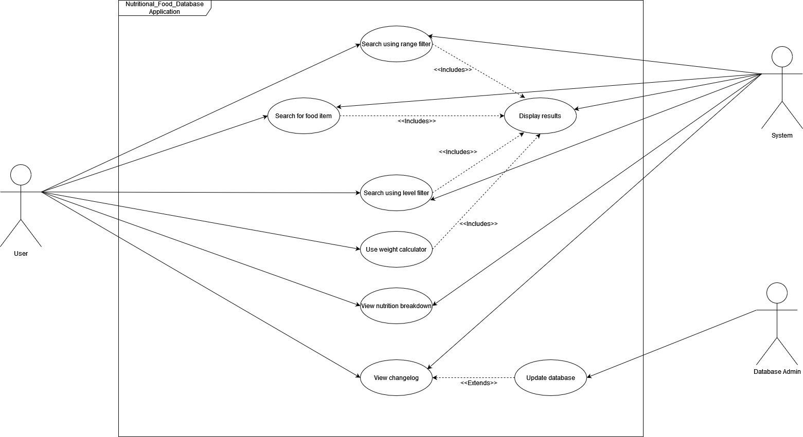
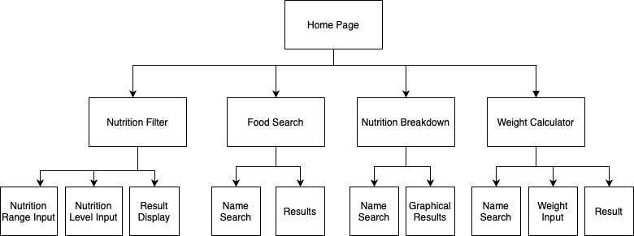
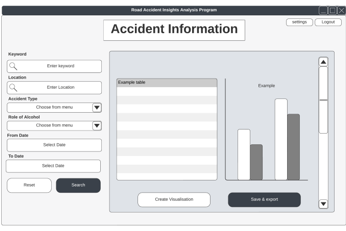

# Software Design Document

## Project Name: Nutritional Food - Assignment.
## Group Number: 59

## Team members

| Student Number | Name          | 
|----------------|---------------|
| s5277614       | Gemma Manns   |
| s5384766       | Joshua Wagner | 
| s5280075       | Juan Martinez | 

# Table of Contents

<!-- TOC -->
* [Software Design Document](#software-design-document)
  * [Project Name: Nutritional Food - Assignment.](#project-name-nutritional-food---assignment)
  * [Group Number: 59](#group-number-59)
  * [Team members](#team-members)
* [Table of Contents](#table-of-contents)
  * [1. System Vision](#1-system-vision)
    * [1.1 Problem Background](#11-problem-background)
    * [1.2 System capabilities/overview](#12-system-capabilitiesoverview)
    * [1.3	Benefit Analysis](#13benefit-analysis)
  * [2. Requirements](#2-requirements)
    * [2.1 User Requirements](#21-user-requirements)
    * [2.2	Software Requirements](#22software-requirements)
    * [2.3 Use Case Diagram](#23-use-case-diagram)
    * [2.4 Use Cases](#24-use-cases)
  * [3.	Software Design and System Components](#3-software-design-and-system-components-)
    * [3.1	Software Design](#31software-design)
    * [3.2	System Components](#32system-components)
      * [3.2.1 Functions](#321-functions)
      * [3.2.2 Data Structures / Data Sources](#322-data-structures--data-sources)
      * [3.2.3 Detailed Design](#323-detailed-design)
  * [4. User Interface Design](#4-user-interface-design)
    * [4.1 Structural Design](#41-structural-design)
    * [4.2	Visual Design](#42visual-design)
<!-- TOC -->

## 1. System Vision (Gemma)

### 1.1 Problem Background

#### Problem Identification: What problem does this system solve?

The system addresses the challenge of accessing and understanding detailed nutritional information for a wide range of food items. Many individuals, healthcare professionals, and dietitians struggle to find reliable and comprehensive nutritional data in a user-friendly format. This tool solves the problem by providing a centralised platform where users can easily search for foods, analyse their nutritional content, and make informed dietary decisions. It facilitates personalised diet planning, supports health and medical research, and helps users manage specific dietary requirements or restrictions.

#### Dataset: What is the dataset used?

The dataset used is a CSV file named Nutritional_Food_Database.csv. This database contains detailed nutritional information for various food items commonly consumed around the world. It includes columns that describe food names and their nutritional content, such as caloric value, fat types, carbohydrates, proteins, vitamins, minerals, and more. The dataset is essential for supporting a wide range of dietary, health, and medical research applications.

#### Data Input/Output: What kind of data input and output is required?
**Data Input:**
- **Text Input:** Users will input text strings when searching for specific food items by name or when selecting nutrients to filter by range or level.
- **Numerical Input:** Users may enter numerical values to set minimum and maximum ranges for specific nutrients, such as calories, fat, or protein content.
- **Selection Input:** Users will use selection inputs, such as drop-down menus or checkboxes, to choose specific nutrients or categories of nutrients for analysis and filtering.

**Data Output:**
- **Textual Output:** The system will display lists of food items along with their corresponding nutritional information based on user searches and filters.
- **Graphical Output:** The tool will generate visual representations, such as pie charts and bar graphs, to illustrate the nutritional breakdown of selected food items. These visuals will help users easily interpret the data and make informed decisions.
- **Filtered Results:** The system will provide filtered lists of foods that meet the criteria set by the user, such as foods within a certain caloric range or with a specific nutrient level.

#### Target Users: Who will use the system, and why?

- **Sports Professionals**: Use the tool to optimise dietary plans for athletes by selecting foods that meet specific nutritional needs, such as high protein or low fat.
- **People with Dietary Requirements or Restrictions**: Individuals with allergies, medical conditions, or personal dietary preferences can use the system to find foods that align with their specific nutritional requirements.
Doctors: Utilise the tool to recommend and plan dietary interventions for patients with specific health conditions, such as diabetes, cardiovascular issues, or obesity.
- **Nutritionists**: Use the system to create balanced diet plans for clients, ensuring that all nutritional needs are met based on detailed food data.
- **Dietitians**: Provide expert advice and feedback on food choices, using the tool to support patient dietary management and to educate clients on healthy eating.
- **Health-Conscious Consumers**: Individuals looking to make informed decisions about their food choices can use the tool to understand the nutritional content of the foods they consume and to plan meals that support their health goals.

### 1.2 System capabilities/overview

- System Functionality: What will the system do?
- Features and Functionalities: Describe the key features and functionalities of the system.

### 1.3	Benefit Analysis

How will this system provide value or benefit?

## 2. Requirements (Josh)

### 2.1 User Requirements

Detail how users are expected to interact with or use the program. What functionalities must the system provide from the end-user perspective? This can include both narrative descriptions and a listing of user needs.

Note: Since no specific client or user is assigned, you may create a fictional user. Who do you envision using your software?

### 2.2	Software Requirements
Define the functionality the software will provide. This section should list requirements formally, often using the word "shall" to describe functionalities.

Example Functional Requirements:  
- R1.1 The program shall accept multiple file names as arguments from the command line.  
- R1.2 Each file name can be a simple file name or include the full path of the file with one or more levels.  

- etc …

### 2.3 Use Case Diagram
Provide a system-level Use Case Diagram illustrating all required features.

Example:  

### 2.4 Use Cases
Include at least 5 use cases, each corresponding to a specific function.

| Use Case ID    | xxx  |
|----------------|------|
| Use Case Name  | xxxx |
| Actors         | xxxx |
| Description    | xxxx |
| Flow of Events | xxxx |
| Alternate Flow | xxxx |

## 3.	Software Design and System Components 

### 3.1	Software Design
Include a flowchart that illustrates how your software will operate.

Example:  

### 3.2	System Components

#### 3.2.1 Functions
List all key functions within the software. For each function, provide:
- Description: Brief explanation of the function’s purpose.
- Input Parameters: List parameters, their data types, and their use.
- Return Value: Describe what the function returns.
- Side Effects: Note any side effects, such as changes to global variables or data passed by reference.

#### 3.2.2 Data Structures / Data Sources
List all data structures or sources used in the software. For each, provide:

- Type: Type of data structure (e.g., list, set, dictionary).
- Usage: Describe where and how it is used.
- Functions: List functions that utilize this structure.

#### 3.2.3 Detailed Design
Provide pseudocode or flowcharts for all functions listed in Section 3.2.1 that operate on data structures. For instance, include pseudocode or a flowchart for a custom searching function.

## 4. User Interface Design

### 4.1 Structural Design
Present a structural design, a hierarchy chart, showing the overall interface’s structure. Address:

- Structure: How will the software be structured?
- Information Grouping: How will information be organized?
- Navigation: How will users navigate through the software?
- Design Choices: Explain why these design choices were made.

Example:  

### 4.2	Visual Design
Include all wireframes or mock-ups of the interface. Provide a discussion, explanation, and justification for your design choices. Hand-drawn wireframes are acceptable.

- Interface Components: Clearly label all components.
- Screens/Menus: Provide wireframes for different screens, menus, and options.
- Design Details: Focus on the layout and size of components; color and graphics are not required. 

Example:  

