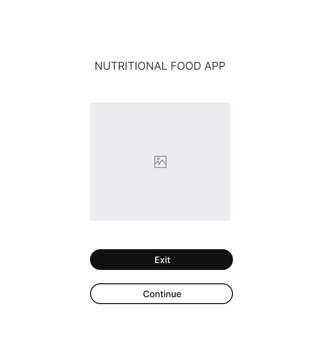
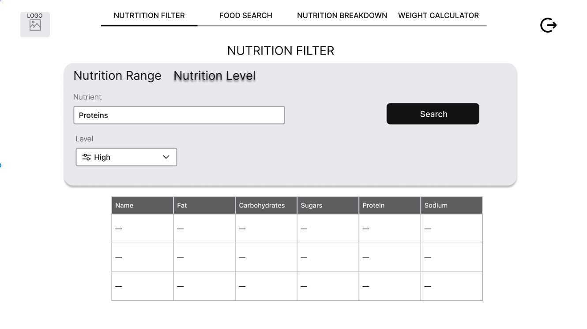
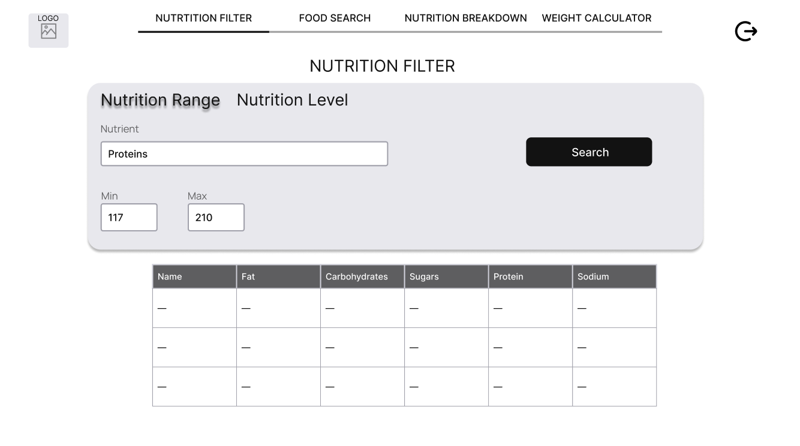
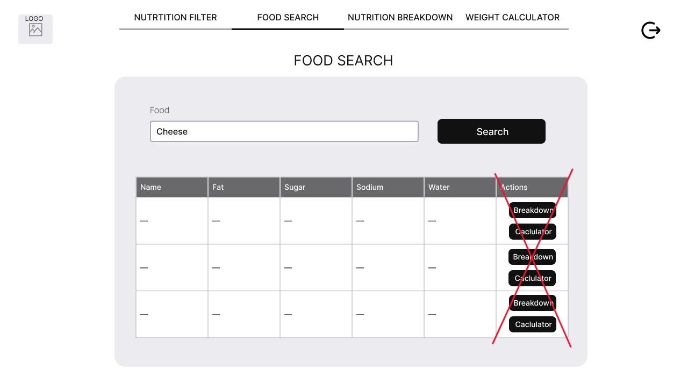
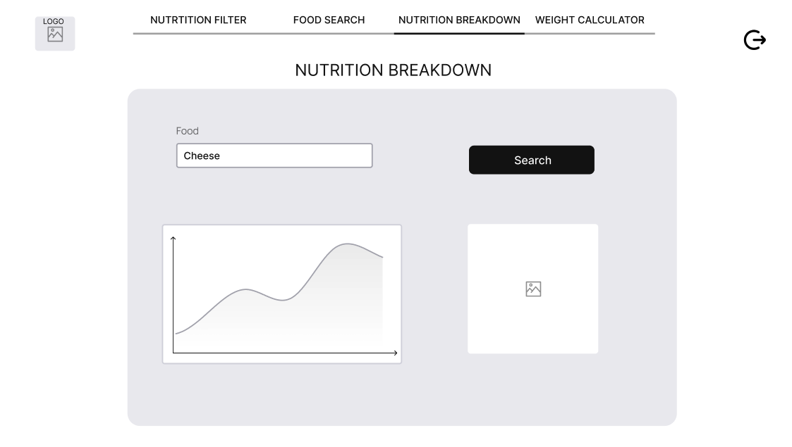
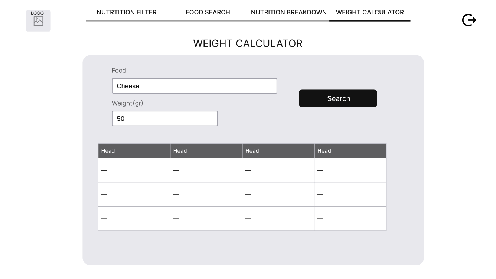

# Software Design Document

## Project Name: Nutritional Food - Assignment.
## Group Number: 59

## Team members

| Student Number | Name          | 
|----------------|---------------|
| s5277614       | Gemma Manns   |
| s5384766       | Joshua Wagner | 
| s5280075       | Juan Martinez | 

# Table of Contents

<!-- TOC -->
* [Software Design Document](#software-design-document)
  * [Project Name: Nutritional Food - Assignment.](#project-name-nutritional-food---assignment)
  * [Group Number: 59](#group-number-59)
  * [Team members](#team-members)
* [Table of Contents](#table-of-contents)
  * [1. System Vision](#1-system-vision)
    * [1.1 Problem Background](#11-problem-background)
    * [1.2 System capabilities/overview](#12-system-capabilitiesoverview)
    * [1.3	Benefit Analysis](#13benefit-analysis)
  * [2. Requirements](#2-requirements)
    * [2.1 User Requirements](#21-user-requirements)
    * [2.2	Software Requirements](#22software-requirements)
    * [2.3 Use Case Diagram](#23-use-case-diagram)
    * [2.4 Use Cases](#24-use-cases)
  * [3.	Software Design and System Components](#3-software-design-and-system-components-)
    * [3.1	Software Design](#31software-design)
    * [3.2	System Components](#32system-components)
      * [3.2.1 Functions](#321-functions)
      * [3.2.2 Data Structures / Data Sources](#322-data-structures--data-sources)
      * [3.2.3 Detailed Design](#323-detailed-design)
  * [4. User Interface Design](#4-user-interface-design)
    * [4.1 Structural Design](#41-structural-design)
    * [4.2	Visual Design](#42visual-design)
<!-- TOC -->

## 1. System Vision

### 1.1 Problem Background

#### Problem Identification: What problem does this system solve?

The system addresses the challenge of accessing and understanding detailed nutritional information for a wide range of food items. Many individuals, healthcare professionals, and dietitians struggle to find reliable and comprehensive nutritional data in a user-friendly format. This tool solves the problem by providing a centralised platform where users can easily search for foods, analyse their nutritional content, and make informed dietary decisions. It facilitates personalised diet planning, supports health and medical research, and helps users manage specific dietary requirements or restrictions.

#### Dataset: What is the dataset used?

The dataset used is a CSV file named Nutritional_Food_Database.csv. This database contains detailed nutritional information for various food items commonly consumed around the world. It includes columns that describe food names and their nutritional content, such as caloric value, fat types, carbohydrates, proteins, vitamins, minerals, and more. The dataset is essential for supporting a wide range of dietary, health, and medical research applications.

#### Data Input/Output: What kind of data input and output is required?
**Data Input:**
- **Text Input:** Users will input text strings when searching for specific food items by name or when selecting nutrients to filter by range or level.
- **Numerical Input:** Users may enter numerical values to set minimum and maximum ranges for specific nutrients, such as calories, fat, or protein content.
- **Selection Input:** Users will use selection inputs, such as drop-down menus or checkboxes, to choose specific nutrients or categories of nutrients for analysis and filtering.

**Data Output:**
- **Textual Output:** The system will display lists of food items along with their corresponding nutritional information based on user searches and filters.
- **Graphical Output:** The tool will generate visual representations, such as pie charts and bar graphs, to illustrate the nutritional breakdown of selected food items. These visuals will help users easily interpret the data and make informed decisions.
- **Filtered Results:** The system will provide filtered lists of foods that meet the criteria set by the user, such as foods within a certain caloric range or with a specific nutrient level.

#### Target Users: Who will use the system, and why?

- **Sports Professionals**: Use the tool to optimise dietary plans for athletes by selecting foods that meet specific nutritional needs, such as high protein or low fat.
- **People with Dietary Requirements or Restrictions**: Individuals with allergies, medical conditions, or personal dietary preferences can use the system to find foods that align with their specific nutritional requirements.
Doctors: Utilise the tool to recommend and plan dietary interventions for patients with specific health conditions, such as diabetes, cardiovascular issues, or obesity.
- **Nutritionists**: Use the system to create balanced diet plans for clients, ensuring that all nutritional needs are met based on detailed food data.
- **Dietitians**: Provide expert advice and feedback on food choices, using the tool to support patient dietary management and to educate clients on healthy eating.
- **Health-Conscious Consumers**: Individuals looking to make informed decisions about their food choices can use the tool to understand the nutritional content of the foods they consume and to plan meals that support their health goals.

### 1.2 System capabilities/overview

Key system capabilities include:

#### Food Search:

Users can input text to search for specific food items by name. The system will return results in a table format, displaying the corresponding nutritional information for each matching food item. This search feature helps users quickly find the foods they are interested in and review their nutritional profiles.
 
#### Nutritional Breakdown:

For any selected food item, the system will display its nutritional breakdown in both numerical and graphical formats. Users can view pie charts and bar graphs that visually represent the nutrient composition, making it easier to understand the relative amounts of calories, fats, proteins, vitamins, and other nutrients.

#### Nutritional Range Filter:

This feature allows users to filter food items by setting minimum and maximum values for specific nutrients, such as calories, fats, or proteins. The system will display all food items that meet the specified nutrient ranges, providing a customised list of results based on the user's requirements.

#### Nutritional Level Filter:

Users can filter food items by predefined nutrient levels (low, medium, or high) compared to the maximum values in the database. This allows for a broader, qualitative search when precise numeric filtering is not necessary or desired. The system will return food items that fall into the selected nutrient level.

#### Weight Calculator:

Users can input a specific food item and a desired serving size (in grams). The system will then calculate the scaled nutritional values based on the input weight, providing personalised nutritional information for different portion sizes. This feature is useful for users aiming for portion control or tailored meal planning.

#### Visual and Textual Output:

The system supports both textual and graphical outputs. In addition to text-based tables listing the nutritional details, the graphical outputs such as pie charts and bar graphs provide a more engaging and intuitive way to analyse food data. This dual format caters to both detailed-oriented users and those who prefer visual summaries.

### 1.3	Benefit Analysis

The Nutritional Food Analysis System provides significant value across various user groups, contributing to better dietary decisions, improved health outcomes, and enhanced professional practice. The benefits of the system include:

**Enhanced Dietary Planning:**
  - Personalised Diets: The system enables users to tailor their diets based on specific nutritional needs, whether for weight management, athletic performance, or medical conditions. By providing detailed nutritional information and filtering options, users can easily find foods that align with their dietary goals.
  - Accurate Nutritional Calculations: The weight-based nutritional calculator allows users to scale the nutritional content of food items, ensuring precise portion control and more accurate dietary planning.

**Improved Health Outcomes:**
  - Informed Food Choices: By offering detailed and reliable nutritional data, the system empowers users to make informed food choices that support their health objectives. This is particularly beneficial for individuals managing conditions like diabetes, cardiovascular diseases, or obesity.
  - Support for Health Professionals: Nutritionists, dietitians, and doctors can use the system to develop and recommend scientifically-backed dietary plans, enhancing patient care and dietary interventions.

**Educational Value:**
  - Nutritional Awareness: The system’s visual representation tools, such as pie charts and bar graphs, make it easier for users to understand the nutritional content of foods. This helps in educating users about balanced diets and the impact of different nutrients on health.
  - Accessible Information: The user-friendly interface and comprehensive database make nutritional information accessible to a wide audience, from health-conscious consumers to professionals in the healthcare industry.

**Time Efficiency:**
  - Quick Food Searches: The advanced search and filtering capabilities allow users to quickly find and analyse food items, saving time compared to traditional methods of dietary research.
  - Streamlined Professional Use: For professionals like nutritionists and dietitians, the system streamlines the process of dietary analysis and planning, allowing them to focus more on client interaction and less on manual data processing.

**Comprehensive Data Access:**
  - Centralised Nutritional Information: The system acts as a central repository for detailed nutritional data, reducing the need to consult multiple sources and ensuring consistency in the information provided.

## 2. Requirements

### 2.1 User Requirements

A frequent user of the software is a **Nutritionist**.
A Nutritionist is a person that advises their clients on their diet and how it impacts their health so its critical they know the right foods to recommend. On behalf of their clients, Nutritionists need to gather a collection of foods that they can recommend to their client so they will often use most or all features of the software during a singular session to gather the desired foods. The nutritionist has their own needs for each feature and how they present the results to their queries.
1.	The **Food Search** must accept a text input and return all applicable foods and their nutritional values on a scrollable table that match or contain the search query.

2.	The **Nutritional Breakdown** will give the nutritionist the option to input a food as text and the software visualises the nutrient composition of the selected food on a pie chart and a bar graph.

3.	The **Nutritional Range** allows the nutritionist to select a nutrient type they want to filter and specify a minimum and maximum value (in g) that they want the results to fall within. When the search button is pressed, the nutritionist expects that the software will display all applicable foods and their nutritional details on a scrollable table.

4.	The **Nutritional Level** allows the nutritionist to select a nutrient type they want to select and a specific nutrient level (Low, Mid or High) compared to the highest value on the database. When the search button is pressed, the nutritionist expects that the software will display all applicable foods and their nutritional details on a scrollable table.

5.	The **Weight Calculator** Allows the nutritionist to input a food as text and a desired weight to scale to. Then the Nutritionist expects the system to visualise the scaled nutritional values on a table and bar graph. 

### 2.2	Software Requirements

#### Functional requirements:
* R1.1 The program shall only accept all standard English letters, symbols and numerical characters as an input.
* R1.2 The program shall use the stored “Nutritional_Food_Database.csv” as its sole source of information and provide search results based on it.
* R2.1 The Food Search shall provide a list of all applicable results that contain the text contents of the user’s input. 
* R3.1 The Nutrition Breakdown function shall show pie charts and bar graphs displaying the nutritional breakdown of the selected food. 
* R4.1 The Nutrition Range Filter shall accept a string value to determine the nutrition being range limited.
* R4.2 The Nutrition Range Filter shall accept floating point values to constrain the minimum and maximum value of a specific nutrition that show up in the results.
* R5.1 The Nutrition Level Filter shall provide a dropdown value to filter their search results based on nutritional density which includes “Low”, “Mid” and “High” as selectable values or “NONE” as a placeholder if undecided.
* R6.1 The Weight calculator feature shall give the option for the user to input a food item in plaintext along with a numerical weight (in grams) in which they can scale the other nutritional values with.
* R6.2 The Weight calculator shall provide a list of scaled nutritional values based on the inputted food and weight. 

#### Non-Functional requirements: 
* R1.1 User Interface shall be clean and easy to navigate.
* R2.1 Widget layout shall be consistent both in size and position.
* R3.1 Widgets shall follow the same layout/sizing practices of other applications.
* R4.1 List of values shall be properly aligned with associated nutrition column names.
* R5.1 Buttons and navigational widgets shall transfer to the correct Frame/ function when interacted with.

### 2.3 Use Case Diagram

### 2.4 Use Cases

| Use Case ID    | UC-01                                                                                                                               |
|----------------|-------------------------------------------------------------------------------------------------------------------------------------|
| Use Case Name  | Search for food item                                                                                                                |
| Actors         | User                                                                                                                                |
| Description    | The user enters an item they want to search for in the textbox and presses search to retrieve all results that match the query.     |
| Flow of Events | 1. The user selects the search bar.                                                                                                 |
|                | 2. The user writes a text input the matches/closely relates to an item they want to search for.                                     |
|                | 3. The user presses search                                                                                                          |
|                | 4. The system retrieves all matching rows.                                                                                          |
|                | 5. The system displays the results (or lack thereof).                                                                               |
| Alternate Flow | 1. If there are no matching results the user is notified through a message after pressing search and sent back to the search screen |

| Use Case ID    | UC-02                                                                                                                                                                                         |
|----------------|-----------------------------------------------------------------------------------------------------------------------------------------------------------------------------------------------|
| Use Case Name  | Search using range filter                                                                                                                                                                     |
| Actors         | User                                                                                                                                                                                          |
| Description    | The user designates one nutritional value to filter by along with defining a minimum and maximum threshold for its corresponding value and returns food items that match the specified values |
| Flow of Events | 1. User selects the nutritional filter feature.                                                                                                                                               |
|                | 2. The user selects “nutritional range” option.                                                                                                                                               |
|                | 3. The user inputs the nutrient they want to filter by.                                                                                                                                       |
|                | 4. The user specifies a floating-point minimum and maximum nutritional value for the nutrient.                                                                                                |
|                | 5. The user presses the “confirm” button.                                                                                                                                                     |
|                | 6. The system retrieves all matching rows.                                                                                                                                                    |
|                | 7. The system displays the results (or lack thereof).                                                                                                                                         |
| Alternate Flow | 1. If there are no matching results the user is notified through a message after pressing search and sent back to the nutritional range screen.                                               |
|                | 2. If the user presses “Filter again” it will return back to the filter screen to repeat the flow of events.                                                                                  |

| Use Case ID    | UC-03                                                                                                                                                                                                                   |
|----------------|-------------------------------------------------------------------------------------------------------------------------------------------------------------------------------------------------------------------------|
| Use Case Name  | Search using level filter                                                                                                                                                                                               |
| Actors         | User                                                                                                                                                                                                                    |
| Description    | The user designates one nutritional value to filter by along with defining if its nutritional levels is “LOW”, “MEDIUM” or “HIGH” compared to the maximum value and returns food items that matches the specified range |
| Flow of Events | 1. User selects the nutritional filter feature.                                                                                                                                                                         |
|                | 2. The user selects “nutritional level” option.                                                                                                                                                                         |
|                | 3. The user inputs the nutrient they want to filter by.                                                                                                                                                                 |
|                | 4. The user specifies if they want the nutritional level to be “LOW”, “MEDIUM” or “HIGH”.                                                                                                                               |
|                | 5. The user presses the “confirm” button.                                                                                                                                                                               |
|                | 6. The system retrieves all matching rows.                                                                                                                                                                              |
|                | 7. The system displays the results (or lack thereof).                                                                                                                                                                   |
| Alternate Flow | 1. If the user presses “Filter again” it will return back to the filter screen to repeat the flow of events.                                                                                                            |

| Use Case ID    | UC-04                                                                                                                           |
|----------------|---------------------------------------------------------------------------------------------------------------------------------|
| Use Case Name  | View nutritional breakdown                                                                                                      |
| Actors         | User                                                                                                                            |
| Description    | The user selects 1 food and the system displays its nutritional breakdown of the food in the form of pie charts and bar graphs. |
| Flow of Events | 1. User selects a food item.                                                                                                    |
|                | 2. The system searches the for the full data of the selected food item.                                                         |
|                | 3. The systems displays pie charts and bar graphs based on the food items nutritional breakdown.                                |
|                | 4. The user specifies if they want the nutritional level to be “LOW”, “MEDIUM” or “HIGH”.                                       |
|                | 5. The user presses the “confirm” button.                                                                                       |
|                | 6. The system retrieves all matching rows.                                                                                      |
|                | 7. The system displays the results (or lack thereof).                                                                           |
| Alternate Flow | 1. The system gives the user an option to select another food item. If selected repeat the flow of events again.                |

| Use Case ID    | UC-05                                                                                                                                                                        |
|----------------|------------------------------------------------------------------------------------------------------------------------------------------------------------------------------|
| Use Case Name  | Weight Calculator                                                                                                                                                            |
| Actors         | User                                                                                                                                                                         |
| Description    | The user inputs a food item and floating-point weight in grams that the system uses to calculate and display the appropriately scaled nutrient composition of the food item. |
| Flow of Events | 1. User selects weight calculator feature.                                                                                                                                   |
|                | 2. User inputs the food item’s name and weight they desire it to be scaled to.                                                                                               |
|                | 3. The system searches for the food item and calculates the results.                                                                                                         |
|                | 4. The system displays the scaled nutrient composition for the specified weight.                                                                                             |
| Alternate Flow | 1. If the food item doesn’t exist in the database the user is prompted to input the food item and weight again.                                                              |
|                | 2. The system gives the user an option to select another food item to calculate. If selected repeat the flow of events again.                                                |                                                                                                                                                                              |

## 3.	Software Design and System Components 

### 3.1	Software Design
 

### 3.2	System Components

####  3.2.1 Updated Functions

### **1. load_data**

- **Description**: Loads the nutritional data from a CSV file into a pandas DataFrame. It ensures error handling for missing or empty files.
- **Input Parameters**:
  - file_path (*str*): The path to the CSV file containing the nutritional data.
- **Return Value**: 
  - A pandas DataFrame containing the loaded data.
- **Side Effects**: 
  - Raises FileNotFoundError if the file is not found or ValueError if the file is empty.

---

### **2. filter_food_by_name**

- **Description**: Filters the DataFrame for food items that contain the specified food_name (partial match, case-insensitive).
- **Input Parameters**:
  - food_name (*str*): The name or partial name of the food to search for.
  - data (*pd.DataFrame*): The DataFrame containing the nutritional data.
- **Return Value**: 
  - A pandas DataFrame containing foods that match the search criteria.
- **Side Effects**: 
  - Raises TypeError if data is not a DataFrame, or ValueError if food_name is not a valid string or if no food items are found.

---

### **3. filter_food_by_exact_name**

- **Description**: Filters the DataFrame for food items that exactly match the specified food_name (case-insensitive).
- **Input Parameters**:
  - food_name (*str*): The exact name of the food to search for.
  - data (*pd.DataFrame*): The DataFrame containing the nutritional data.
- **Return Value**: 
  - A pandas DataFrame containing the exact matching food item.
- **Side Effects**: 
  - Raises TypeError if data is not a DataFrame, or ValueError if food_name is not a valid string or if no exact matches are found.

---

### **4. nutrition_breakdown**

- **Description**: Retrieves the nutritional breakdown for a specific food item. Optionally allows filtering for specific nutrients.
- **Input Parameters**:
  - food_name (*str*): The exact name of the food item.
  - data (*pd.DataFrame*): The DataFrame containing the nutritional data.
  - nutrients (*list*, optional): A list of specific nutrients to include in the breakdown. Defaults to None.
- **Return Value**: 
  - A pandas DataFrame containing the nutritional breakdown of the food item.
- **Side Effects**: 
  - Raises ValueError if the food name is invalid or if any nutrient is not found. Returns an empty Series if no valid food item is found.

---

### **5. calculate_nutrients**

- **Description**: Calculates the nutritional values for a specified weight of a food item.
- **Input Parameters**:
  - food_name (*str*): The exact name of the food item.
  - weight (*float*): The weight in grams for which to calculate the nutrients.
  - data (*pd.DataFrame*): The DataFrame containing the nutritional data.
- **Return Value**: 
  - A pandas Series containing the scaled nutritional values for the specified weight.
- **Side Effects**: 
  - Raises ValueError if the weight is non-positive or if no valid nutrient data is found.

---

### **6. nutrition_range_filter**

-   **Description**: Filters the food data based on a range of values for a given nutrient (i.e., within a minimum and maximum).
    
-   **Input Parameters**:
    
    -   nutrient_input  (str): The nutrient to filter by.
    -   nutrient_min_input  (str): The minimum value of the nutrient.
    -   nutrient_max_input  (str): The maximum value of the nutrient.
    -   data  (pd.DataFrame): The data to search through.
-   **Return Value**: Likely returns a DataFrame or a list of food items that match the nutrient range criteria, though it is not fully visible in the snippet.
    
-   **Side Effects**: Raises  TypeError  if  data  is not a DataFrame and  ValueError  if inputs for nutrient name, minimum, or maximum are invalid.

---

### **7. nutrition_filter_min_max**

-   **Description**: Returns the minimum and maximum percentage values for a nutrient based on the given level (low, medium, or high).
    
-   **Input Parameters**:
    
    -   level  (str): The level of nutrient content ("low", "medium", "high").
-   **Return Value**: Returns two values,  (p_low, p_high), representing the lower and upper bounds for the nutrient level.
    
-   **Side Effects**: Raises  ValueError  if an invalid level is provided.

---
### **8. nutrition_level_filter**

-   **Description**: Filters food items based on the nutrient level (low, medium, or high) for a specific nutrient.
    
-   **Input Parameters**:
    
    -   nutrient_input  (str): The nutrient to filter by.
    -   nutrient_level  (str): The desired level of the nutrient ("low", "medium", "high").
    -   data (pd.DataFrame): The data to search through.
-   **Return Value**: Returns a list (Boolean values) indicating whether each food item matches the specified nutrient level.
    
-   **Side Effects**: Raises  TypeError  if  data  is not a valid DataFrame, and raises  ValueError  or  KeyError  for invalid inputs (e.g., missing nutrient columns).

####  3.2.2 Updated Data Structures / Data Sources

### 1.  **file_path  (str)**

-   **Type**: String
-   **Usage**:
    -   Used to specify the file path for loading a CSV file containing the nutritional data.
    -   The string represents the location of the CSV file on the system.
-   **Functions**:
    -   load_data(file_path)

----------

### 2.  **food_name  (str)**

-   **Type**: String
-   **Usage**:
    -   Represents the name (either partial or exact) of a food item to search for in the nutritional database.
    -   Used for searching and filtering food items by name in the DataFrame.
-   **Functions**:
    -   filter_food_by_name(food_name, data)
    -   filter_food_by_exact_name(food_name, data)
    -   nutrition_breakdown(food_name, data, nutrients)
    -   calculate_nutrients(food_name, data, weight_input, nutrients)

----------

### 3.  **data  (pd.DataFrame)**

-   **Type**: Pandas DataFrame
-   **Usage**:
    -   The primary data structure that contains the comprehensive nutritional food database.
    -   Stores rows of food items and columns representing attributes (e.g., food name, nutrient values).
    -   Used for searching, filtering, and retrieving nutritional data.
-   **Functions**:
    -   filter_food_by_name(food_name, data)
    -   filter_food_by_exact_name(food_name, data)
    -   nutrition_breakdown(food_name, data, nutrients)
    -   calculate_nutrients(food_name, data, weight_input, nutrients)
    -   nutrition_range_filter(nutrient_input, nutrient_min_input, nutrient_max_input, data)
    -   nutrition_level_filter(nutrient_input, nutrient_level, data)

----------

### 4.  **nutrients  (list)**

-   **Type**: List
-   **Usage**:
    -   An optional list that specifies which nutrient values to filter or retrieve from the DataFrame.
    -   Used to narrow down nutrient data to only the specified nutrient columns.
-   **Functions**:
    -   nutrition_breakdown(food_name, data, nutrients)
    -   calculate_nutrients(food_name, data, weight_input, nutrients)

----------

### 5.  **weight_input  (str)**

-   **Type**: String
-   **Usage**:
    -   Represents the weight (usually in grams) of the food item to calculate nutrient values for.
    -   The string is converted to a float to perform calculations.
-   **Functions**:
    -   calculate_nutrients(food_name, data, weight_input, nutrients)

----------

### 6.  **nutrient_input  (str)**

-   **Type**: String
-   **Usage**:
    -   Represents the name of the nutrient for filtering.
    -   Used to specify which nutrient column to filter on in the DataFrame.
-   **Functions**:
    -   nutrition_range_filter(nutrient_input, nutrient_min_input, nutrient_max_input, data)
    -   nutrition_level_filter(nutrient_input, nutrient_level, data)

----------

####  3.2.3 Updated Detailed Design

**load_data** 

START\
FUNCTION load_data(file_path):\
    TRY:\
        Load the CSV file from the file_path into a DataFrame (df)\
    CATCH FileNotFoundError: \
        Raise "File not found" error \
    CATCH EmptyDataError: \ 
        Raise "No data found in the file" error \
    RETURN the loaded DataFrame (df) \
END

**filter_food_by_name** \
\
START\
FUNCTION filter_food_by_name(food_name, data):\
    IF data is not a DataFrame:\
        Raise "The provided data is not a DataFrame" error \
    IF food_name is not a valid non-empty string: \
        Raise "The food name must be a non-empty string" error \ 
Search for rows in the DataFrame where the 'food' column contains food_name (case-insensitive) \
IF no rows are found: \
Raise "No food item found" error \
RETURN the filtered DataFrame with matching food items\
END\
\
**filter_food_by_exact_name** \
\
START \
Function filter_food_by_exact_name(food_name, data): \
If data is not a DataFrame: \
Raise an error saying the input is not a valid DataFrame \
If food_name is not a valid string or is empty: \
Raise an error for invalid input \
Filter the 'food' column of the DataFrame for rows that exactly match the food_name (case-insensitive) \
If no matches found: \
Raise an error saying no food items were found \
If multiple matches found: \
Raise an error saying there are multiple entries for the food name \
Return the filtered DataFrame \
END
\
\
**nutrition_breakdown** \
\
START \
Function nutrition_breakdown(food_name, data, nutrients=None): \
If food_name is not a valid string or is empty: \
Raise an error for invalid input \
If data is not a DataFrame: \
Raise an error saying the input is not a valid DataFrame \
Filter the DataFrame using filter_food_by_exact_name to get the food item \
If nutrients list is provided: \
Select only the columns of the specific nutrients from the food item \
Return the nutritional breakdown of the food item \
END
\
\
**calculate_nutrients**

START \
Function calculate_nutrients(food_name, weight, data): \
If weight is not a positive number: \
Raise an error for invalid input \
If data is not a DataFrame: \
Raise an error saying the input is not a valid DataFrame \
Filter the DataFrame using filter_food_by_exact_name to get the food item \
Scale the nutrient values by (weight / 100) \
Return the scaled nutrient values \
END

\
**nutrition_range_filter**

START \
Function nutrition_range_filter(nutrient, min_val, max_val, data): \
If data is not a DataFrame:\
Raise an error saying the input is not a valid DataFrame \
If nutrient is not a valid string or is empty: \
Raise an error for invalid input \
If min_val or max_val are not valid numbers: \
Raise an error for invalid input \
Filter the DataFrame to include rows where the nutrient values are between min_val and max_val \
If no matching foods are found: \
Raise an error saying no foods are found in the range \
Return the filtered DataFrame \

END

\
**nutrition_filter_min_max**

START
Function nutrition_filter_min_max(nutrient, level, data): \
If data is not a DataFrame:\
Raise an error saying the input is not a valid DataFrame\
If nutrient or level is not valid:\
Raise an error for invalid input\
Depending on the level:\
If level is 'low':\
Filter the DataFrame for foods where the nutrient is in the lower range\
If level is 'medium': \
Filter the DataFrame for foods where the nutrient is in the middle range \
If level is 'high': \
Filter the DataFrame for foods where the nutrient is in the higher range \
If no matching foods are found: \ 
Raise an error saying no foods match the nutrient level \
Return the filtered DataFrame \

END

**nutrition_level_filter**

START\
FUNCTION nutrition_level_filter(nutrient_input, nutrient_level, data):\
IF nutrient_input is not a valid non-empty string:\
Raise "The nutrient must be a non-empty string" error\
IF nutrient_level is not a valid non-empty string:\
Raise "The nutrient level must be a non-empty string" error\
IF data is not a DataFrame:\
Raise "The provided data is not a valid DataFrame" error\
CALL nutrition_filter_min_max(nutrient_level) \
TO get the range of values (p_low, p_high) for the nutrient level\
Initialize food_arr as an empty array\
IF nutrient_input is not found in the data: 
Raise 'Nutrient 'name' not found in the table" error\
LOOP through each item in the data\
IF the nutrient value matches the filter criteria\
APPEND the Boolean value to the food_arr. \
Return the array with Boolean values.\
END

## 4. User Interface Design

### 4.1 Structural Design

**Structure: How will the software be structured?**

The software is structured in a modular fashion, with each primary feature represented as a distinct module linked from the Home Page. This modular approach ensures that each feature is self-contained, simplifying maintenance, updates, and scalability.

- **Home Page:** Serves as the central hub, directing users to the core features.
- **Food Search:** Allows users to search for food items and view detailed nutritional information.
- **Nutrition Breakdown:** Provides visual representations (charts/graphs) of the nutritional content of selected foods.
- **Nutrition Range Filter:** Enables users to filter foods by specific nutrient ranges.
- **Nutrition Level Filter:** Allows users to filter foods by predefined nutritional levels (low, mid, high).
- **Weight Calculator:** Allows users to search for a food and input a weight to see the nutrient breakdown for that serving size.

**Information Grouping: How will information be organized?**

Information is organised into logical groups based on functionality:

**Search & Retrival** 
- Food Search: Users can enter a food name to retrieve its detailed nutritional profile.

**Visualisation:**
- Nutrition Breakdown: Users can view visual breakdowns of nutrients for a selected food.

**Filtering:**
- Nutrition Range Filter: Users can set nutrient ranges to filter foods.
- Nutrition Level Filter: Users can filter foods based on predefined nutrient levels.

**Nutrient Calculation:**
- Weight Calculator: Users can input a food item and specify a weight in grams to view the nutrient breakdown for that serving size. Retrieval:

**Navigation: How will users navigate through the software?**

<ins>Home Page as Central Hub:</ins>

Users begin at the Home Page, which provides links to all primary modules.
A consistent navigation bar at the top of the interface ensures that users can easily switch between modules or exit the application.

<ins>Navigation Flow:</ins> 

Home Page → Food Search: Enter food names and view detailed profiles.
Home Page → Nutrition Breakdown: Select a food to view its nutritional breakdown in various visual formats.
Home Page → Nutrition Range amd Level Filter: Set ranges for specific nutrients and view filtered results and select nutrient levels and view foods that match.
Home Page → Weight Calculator: Search for a food, input a weight in grams, and view the nutrient breakdown for that specific serving size.

**Design Choices: Explain why these design choices were made.**

<ins>Modularity:</ins> 

Justification: The modular structure simplifies the tool’s design, making it easier to update or expand specific features without affecting the entire system. Each module is self-contained and focused, ensuring that users can complete tasks efficiently.

<ins>User-Centric Design:</ins>

Justification: The structure is intuitive, with clear entry points for each function. This design choice prioritises ease of use, allowing users to accomplish their goals with minimal navigation or confusion.

<ins>Consistent Navigation:</ins>

Justification: A consistent navigation bar provides users with a sense of orientation within the tool, reducing cognitive load and preventing them from getting lost. Quick access to the Home Page or other modules ensures that users can move through the tool fluidly.

<ins>Visual Hierarchy:</ins>

Justification: The organisation of information into distinct groups based on functionality (Search & Retrieval, Visualisation, Filtering, Nutrient Calculation) allows users to quickly identify where to go for specific tasks. This reduces the time spent searching for features and improves overall usability.

### 4.2	Visual Design

The wireframes correspond to different screens in the user journey as described in the flowchart. These include the welcome screen, nutrition filter, food search, nutrition breakdown, and weight calculator. Each wireframe represents a critical component of the application’s interface.

#### 4.2.1 Wireframe Breakdown and Justification

##### **Wireframe 1: Welcome Screen**

- **Visual Components**:
    - Two buttons: "Exit" and "Continue."
    - Centered image placeholder (likely for branding or a welcome illustration).
- **Functional Justification**:
    - **Exit button**: Allows users to quickly close the application, providing an easy and intuitive exit option.
    - **Continue button**: Prominently placed for immediate user interaction, guiding them toward the main interface.
    - **Image**: Placeholder may serve as a space for branding, adding visual engagement.
- **User Flow**: Simple decision-making process at the beginning, either to exit the app or proceed to the main interface.
- **Justification**: This screen minimizes decision fatigue by offering only two key choices, streamlining the user’s first interaction with the application.

##### **Updated Wireframe 2: Nutrition Filter**

**Image Updated to have "nutrition range" and "nutrition level" sections navigated to via tabs on the nutrition filer screen**

- **Visual Components**:
    - Two filtering sections: one for "Nutrition Range" and one for "Nutrition Level."
    - Data table displaying filtered results based on user input.
- **Functional Justification**:
    - **Nutrition Range filter**: Allows users to input a minimum and maximum range for a nutrient (e.g., proteins), giving precise control over the search results.
    - **Nutrition Level filter**: Offers predefined levels (e.g., low, mid, high), which simplifies the search for users who may not have specific numbers in mind.
    - **Search buttons**: Clear and prominent to trigger data retrieval after input.
    - **Data table**: Presents key nutritional metrics for the filtered foods, providing a clear overview.
- **User Flow**: Users can easily switch between filtering by range or by level and immediately see the results displayed below.
- **Justification**: This design supports users who want a more detailed or broader search of food data. It caters to different levels of expertise.

##### **Wireframe 3: Food Search**

- **Visual Components**:
    - Input field for food name.
    - Results table showing nutritional values.
    - Actions buttons: "Breakdown" and "Calculator."
- **Functional Justification**:
    - **Search field**: Users input the name of a food item (e.g., "Cheese"), making it a direct search functionality.
    - **Results table**: Displays key metrics like fat, sugar, sodium, etc., allowing users to scan for the necessary data quickly.
    - **Breakdown and Calculator buttons**: These offer further actions, leading users to more detailed analyses or weight calculations based on the selected food.
- **User Flow**: A simple search leads to clear and actionable next steps, allowing users to drill down into the data if needed.
- **Justification**: This wireframe provides a straightforward way for users to search for a specific food, see its data, and perform advanced actions like breakdowns and calculations, enhancing usability.

##### **Updated Wireframe 4: Nutrition Breakdown**

**Image Updated to remove the food selection input, leaving only the text input**

- **Visual Components**:
    - Input field for food.
    - Graph for visualizing nutritional data.
- **Functional Justification**:
    - **Graphical representation**: Helps users understand data trends easily through visual breakdowns, enhancing comprehension.
    - **Food input**: Users can switch between different foods, offering flexibility in comparing different items.
- **User Flow**: After inputting a food item, users are presented with a graphical representation of the food’s nutritional breakdown, making the data easier to interpret.
- **Justification**: Visual aids such as graphs are effective tools for data communication, especially in applications involving complex data like nutrition. This design choice helps simplify the information for non-expert users.

##### **Wireframe 5: Weight Calculator**

**Removed the graphical display of data, leaving only table**
- **Visual Components**:
    - Input field for food and weight.
    - Results table with calculated values based on the input weight.
- **Functional Justification**:
    - **Weight input**: Allows users to calculate nutritional values based on a specific serving size, providing personalized data.
    - **Results table**: These numerically display the calculated values, ensuring users get a detailed view of the data.
- **User Flow**: Users input food and weight, then receive tailored nutritional data.
- **Justification**: This wireframe adds personalization by allowing users to adjust serving sizes and see the nutritional impact. It’s especially useful for users tracking their intake or tailoring it to specific needs.

#### 4.2.2 Consistency Across Wireframes

- **Navigation**: The top menu remains consistent, with navigation options like "Nutrition Filter", "Food Search", "Nutrition Breakdown", and "Weight Calculator". This ensures users can switch between features without confusion. The "Exit" button is consistently placed in the top-right corner of all screens except the Welcome Screen. This ensures that users have a clear and accessible option to exit the application at any time, contributing to a smooth user experience.
- **Visual Consistency**: The use of input fields, buttons, and tables follows a standardized format across wireframes, creating a good user experience.
- **Justification**: Maintaining consistency in user navigation and layout helps reduce the cognitive load on users and ensures that they can use the app efficiently across different features.

