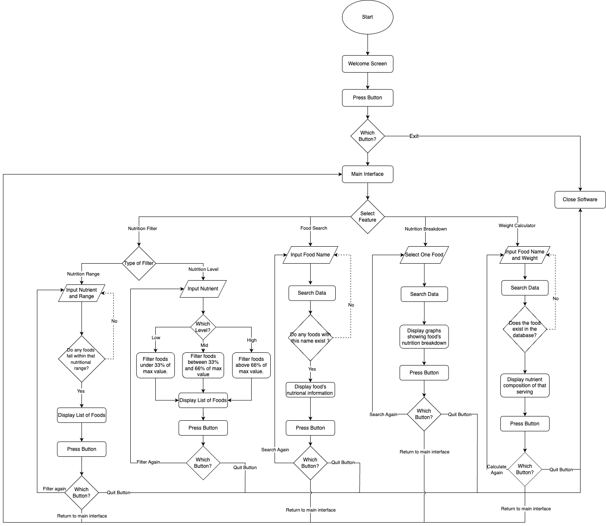

# Software Design Document

## Project Name: Nutritional Food - Assignment.
## Group Number: 59

## Team members

| Student Number | Name          | 
|----------------|---------------|
| s5277614       | Gemma Manns   |
| s5384766       | Joshua Wagner | 
| s5280075       | Juan Martinez | 

# Table of Contents

<!-- TOC -->
* [Software Design Document](#software-design-document)
  * [Project Name: Nutritional Food - Assignment.](#project-name-nutritional-food---assignment)
  * [Group Number: 59](#group-number-59)
  * [Team members](#team-members)
* [Table of Contents](#table-of-contents)
  * [1. System Vision](#1-system-vision)
    * [1.1 Problem Background](#11-problem-background)
    * [1.2 System capabilities/overview](#12-system-capabilitiesoverview)
    * [1.3	Benefit Analysis](#13benefit-analysis)
  * [2. Requirements](#2-requirements)
    * [2.1 User Requirements](#21-user-requirements)
    * [2.2	Software Requirements](#22software-requirements)
    * [2.3 Use Case Diagram](#23-use-case-diagram)
    * [2.4 Use Cases](#24-use-cases)
  * [3.	Software Design and System Components](#3-software-design-and-system-components-)
    * [3.1	Software Design](#31software-design)
    * [3.2	System Components](#32system-components)
      * [3.2.1 Functions](#321-functions)
      * [3.2.2 Data Structures / Data Sources](#322-data-structures--data-sources)
      * [3.2.3 Detailed Design](#323-detailed-design)
  * [4. User Interface Design](#4-user-interface-design)
    * [4.1 Structural Design](#41-structural-design)
    * [4.2	Visual Design](#42visual-design)
<!-- TOC -->

## 1. System Vision

### 1.1 Problem Background

#### Problem Identification: What problem does this system solve?

The system addresses the challenge of accessing and understanding detailed nutritional information for a wide range of food items. Many individuals, healthcare professionals, and dietitians struggle to find reliable and comprehensive nutritional data in a user-friendly format. This tool solves the problem by providing a centralised platform where users can easily search for foods, analyse their nutritional content, and make informed dietary decisions. It facilitates personalised diet planning, supports health and medical research, and helps users manage specific dietary requirements or restrictions.

#### Dataset: What is the dataset used?

The dataset used is a CSV file named Nutritional_Food_Database.csv. This database contains detailed nutritional information for various food items commonly consumed around the world. It includes columns that describe food names and their nutritional content, such as caloric value, fat types, carbohydrates, proteins, vitamins, minerals, and more. The dataset is essential for supporting a wide range of dietary, health, and medical research applications.

#### Data Input/Output: What kind of data input and output is required?
**Data Input:**
- **Text Input:** Users will input text strings when searching for specific food items by name or when selecting nutrients to filter by range or level.
- **Numerical Input:** Users may enter numerical values to set minimum and maximum ranges for specific nutrients, such as calories, fat, or protein content.
- **Selection Input:** Users will use selection inputs, such as drop-down menus or checkboxes, to choose specific nutrients or categories of nutrients for analysis and filtering.

**Data Output:**
- **Textual Output:** The system will display lists of food items along with their corresponding nutritional information based on user searches and filters.
- **Graphical Output:** The tool will generate visual representations, such as pie charts and bar graphs, to illustrate the nutritional breakdown of selected food items. These visuals will help users easily interpret the data and make informed decisions.
- **Filtered Results:** The system will provide filtered lists of foods that meet the criteria set by the user, such as foods within a certain caloric range or with a specific nutrient level.

#### Target Users: Who will use the system, and why?

- **Sports Professionals**: Use the tool to optimise dietary plans for athletes by selecting foods that meet specific nutritional needs, such as high protein or low fat.
- **People with Dietary Requirements or Restrictions**: Individuals with allergies, medical conditions, or personal dietary preferences can use the system to find foods that align with their specific nutritional requirements.
Doctors: Utilise the tool to recommend and plan dietary interventions for patients with specific health conditions, such as diabetes, cardiovascular issues, or obesity.
- **Nutritionists**: Use the system to create balanced diet plans for clients, ensuring that all nutritional needs are met based on detailed food data.
- **Dietitians**: Provide expert advice and feedback on food choices, using the tool to support patient dietary management and to educate clients on healthy eating.
- **Health-Conscious Consumers**: Individuals looking to make informed decisions about their food choices can use the tool to understand the nutritional content of the foods they consume and to plan meals that support their health goals.

### 1.2 System capabilities/overview

The System will do the following:

- Display results from the following searches of the Database:
  - Food Search - Text search names for specific entries. 
  - Nutrition Range Filter - Filter entries by nutrition values
  - Nutrition Level Filter - Filter entries by nutritional content levels. 
- Display the nutritional breakdown of entries when selected by the end user, in both numerical and graphical form.  
- View Changelog

### 1.3	Benefit Analysis

The Nutritional Food Analysis System provides significant value across various user groups, contributing to better dietary decisions, improved health outcomes, and enhanced professional practice. The benefits of the system include:

**Enhanced Dietary Planning:**
  - Personalised Diets: The system enables users to tailor their diets based on specific nutritional needs, whether for weight management, athletic performance, or medical conditions. By providing detailed nutritional information and filtering options, users can easily find foods that align with their dietary goals.
  - Accurate Nutritional Calculations: The weight-based nutritional calculator allows users to scale the nutritional content of food items, ensuring precise portion control and more accurate dietary planning.

**Improved Health Outcomes:**
  - Informed Food Choices: By offering detailed and reliable nutritional data, the system empowers users to make informed food choices that support their health objectives. This is particularly beneficial for individuals managing conditions like diabetes, cardiovascular diseases, or obesity.
  - Support for Health Professionals: Nutritionists, dietitians, and doctors can use the system to develop and recommend scientifically-backed dietary plans, enhancing patient care and dietary interventions.

**Educational Value:**
  - Nutritional Awareness: The system’s visual representation tools, such as pie charts and bar graphs, make it easier for users to understand the nutritional content of foods. This helps in educating users about balanced diets and the impact of different nutrients on health.
  - Accessible Information: The user-friendly interface and comprehensive database make nutritional information accessible to a wide audience, from health-conscious consumers to professionals in the healthcare industry.

**Time Efficiency:**
  - Quick Food Searches: The advanced search and filtering capabilities allow users to quickly find and analyse food items, saving time compared to traditional methods of dietary research.
  - Streamlined Professional Use: For professionals like nutritionists and dietitians, the system streamlines the process of dietary analysis and planning, allowing them to focus more on client interaction and less on manual data processing.

**Comprehensive Data Access:**
  - Centralised Nutritional Information: The system acts as a central repository for detailed nutritional data, reducing the need to consult multiple sources and ensuring consistency in the information provided.

## 2. Requirements

### 2.1 User Requirements

A frequent user of the software is a **Nutritionist**.
A Nutritionist is a person that advises their clients on their diet and how it impacts their health so its critical they know the right foods to recommend. On behalf of their clients, Nutritionists need to gather a collection of foods that they can recommend to their client so they will often use most or all features of the software during a singular session to gather the desired foods. The nutritionist has their own needs for each feature and how they present the results to their queries.
1.	The **Food Search** must accept a text input and return all applicable foods and their nutritional values on a scrollable table that match or contain the search query.

2.	The **Nutritional Breakdown** will give the nutritionist the option to input a food as text and the software visualises the nutrient composition of the selected food on a pie chart and a bar graph.

3.	The **Nutritional Range** allows the nutritionist to select a nutrient type they want to filter and specify a minimum and maximum value (in g) that they want the results to fall within. When the search button is pressed, the nutritionist expects that the software will display all applicable foods and their nutritional details on a scrollable table.

4.	The **Nutritional Level** allows the nutritionist to select a nutrient type they want to select and a specific nutrient level (Low, Mid or High) compared to the highest value on the database. When the search button is pressed, the nutritionist expects that the software will display all applicable foods and their nutritional details on a scrollable table.

5.	The **Weight Calculator** Allows the nutritionist to input a food as text and a desired weight to scale to. Then the Nutritionist expects the system to visualise the scaled nutritional values on a table and bar graph. 

### 2.2	Software Requirements

#### Functional requirements:
* R1.1 The program shall only accept all standard English letters, symbols and numerical characters as an input.
* R1.2 The program shall use the stored “Nutritional_Food_Database.csv” as its sole source of information and provide search results based on it.
* R2.1 The Food Search shall provide a list of all applicable results that contain the text contents of the user’s input. 
* R3.1 The Nutrition Breakdown function shall show pie charts and bar graphs displaying the nutritional breakdown of the selected food. 
* R4.1 The Nutrition Range Filter shall accept a string value to determine the nutrition being range limited.
* R4.2 The Nutrition Range Filter shall accept floating point values to constrain the minimum and maximum value of a specific nutrition that show up in the results.
* R5.1 The Nutrition Level Filter shall provide a dropdown value to filter their search results based on nutritional density which includes “Low”, “Mid” and “High” as selectable values or “NONE” as a placeholder if undecided.
* R6.1 The Weight calculator feature shall give the option for the user to input a food item in plaintext along with a numerical weight (in grams) in which they can scale the other nutritional values with.
* R6.2 The Weight calculator shall provide a list of scaled nutritional values based on the inputted food and weight. 

#### Non-Functional requirements: 
* R1.1 User Interface shall be clean and easy to navigate.
* R2.1 Widget layout shall be consistent both in size and position.
* R3.1 Widgets shall follow the same layout/sizing practices of other applications.
* R4.1 List of values shall be properly aligned with associated nutrition column names.
* R5.1 Buttons and navigational widgets shall transfer to the correct Frame/ function when interacted with.

### 2.3 Use Case Diagram

### 2.4 Use Cases

| Use Case ID    | UC-01                                                                                                                               |
|----------------|-------------------------------------------------------------------------------------------------------------------------------------|
| Use Case Name  | Search for food item                                                                                                                |
| Actors         | User                                                                                                                                |
| Description    | The user enters an item they want to search for in the textbox and presses search to retrieve all results that match the query.     |
| Flow of Events | 1. The user selects the search bar.                                                                                                 |
|                | 2. The user writes a text input the matches/closely relates to an item they want to search for.                                     |
|                | 3. The user presses search                                                                                                          |
|                | 4. The system retrieves all matching rows.                                                                                          |
|                | 5. The system displays the results (or lack thereof).                                                                               |
| Alternate Flow | 1. If there are no matching results the user is notified through a message after pressing search and sent back to the search screen |

| Use Case ID    | UC-02                                                                                                                                                                                         |
|----------------|-----------------------------------------------------------------------------------------------------------------------------------------------------------------------------------------------|
| Use Case Name  | Search using range filter                                                                                                                                                                     |
| Actors         | User                                                                                                                                                                                          |
| Description    | The user designates one nutritional value to filter by along with defining a minimum and maximum threshold for its corresponding value and returns food items that match the specified values |
| Flow of Events | 1. User selects the nutritional filter feature.                                                                                                                                               |
|                | 2. The user selects “nutritional range” option.                                                                                                                                               |
|                | 3. The user inputs the nutrient they want to filter by.                                                                                                                                       |
|                | 4. The user specifies a floating-point minimum and maximum nutritional value for the nutrient.                                                                                                |
|                | 5. The user presses the “confirm” button.                                                                                                                                                     |
|                | 6. The system retrieves all matching rows.                                                                                                                                                    |
|                | 7. The system displays the results (or lack thereof).                                                                                                                                         |
| Alternate Flow | 1. If there are no matching results the user is notified through a message after pressing search and sent back to the nutritional range screen.                                               |
|                | 2. If the user presses “Filter again” it will return back to the filter screen to repeat the flow of events.                                                                                  |

| Use Case ID    | UC-03                                                                                                                                                                                                                   |
|----------------|-------------------------------------------------------------------------------------------------------------------------------------------------------------------------------------------------------------------------|
| Use Case Name  | Search using level filter                                                                                                                                                                                               |
| Actors         | User                                                                                                                                                                                                                    |
| Description    | The user designates one nutritional value to filter by along with defining if its nutritional levels is “LOW”, “MEDIUM” or “HIGH” compared to the maximum value and returns food items that matches the specified range |
| Flow of Events | 1. User selects the nutritional filter feature.                                                                                                                                                                         |
|                | 2. The user selects “nutritional level” option.                                                                                                                                                                         |
|                | 3. The user inputs the nutrient they want to filter by.                                                                                                                                                                 |
|                | 4. The user specifies if they want the nutritional level to be “LOW”, “MEDIUM” or “HIGH”.                                                                                                                               |
|                | 5. The user presses the “confirm” button.                                                                                                                                                                               |
|                | 6. The system retrieves all matching rows.                                                                                                                                                                              |
|                | 7. The system displays the results (or lack thereof).                                                                                                                                                                   |
| Alternate Flow | 1. If the user presses “Filter again” it will return back to the filter screen to repeat the flow of events.                                                                                                            |

| Use Case ID    | UC-04                                                                                                                           |
|----------------|---------------------------------------------------------------------------------------------------------------------------------|
| Use Case Name  | View nutritional breakdown                                                                                                      |
| Actors         | User                                                                                                                            |
| Description    | The user selects 1 food and the system displays its nutritional breakdown of the food in the form of pie charts and bar graphs. |
| Flow of Events | 1. User selects a food item.                                                                                                    |
|                | 2. The system searches the for the full data of the selected food item.                                                         |
|                | 3. The systems displays pie charts and bar graphs based on the food items nutritional breakdown.                                |
|                | 4. The user specifies if they want the nutritional level to be “LOW”, “MEDIUM” or “HIGH”.                                       |
|                | 5. The user presses the “confirm” button.                                                                                       |
|                | 6. The system retrieves all matching rows.                                                                                      |
|                | 7. The system displays the results (or lack thereof).                                                                           |
| Alternate Flow | 1. The system gives the user an option to select another food item. If selected repeat the flow of events again.                |

| Use Case ID    | UC-05                                                                                                                                                                        |
|----------------|------------------------------------------------------------------------------------------------------------------------------------------------------------------------------|
| Use Case Name  | Weight Calculator                                                                                                                                                            |
| Actors         | User                                                                                                                                                                         |
| Description    | The user inputs a food item and floating-point weight in grams that the system uses to calculate and display the appropriately scaled nutrient composition of the food item. |
| Flow of Events | 1. User selects weight calculator feature.                                                                                                                                   |
|                | 2. User inputs the food item’s name and weight they desire it to be scaled to.                                                                                               |
|                | 3. The system searches for the food item and calculates the results.                                                                                                         |
|                | 4. The system displays the scaled nutrient composition for the specified weight.                                                                                             |
| Alternate Flow | 1. If the food item doesn’t exist in the database the user is prompted to input the food item and weight again.                                                              |
|                | 2. The system gives the user an option to select another food item to calculate. If selected repeat the flow of events again.                                                |                                                                                                                                                                              |

## 3.	Software Design and System Components 

### 3.1	Software Design
 

### 3.2	System Components

#### 3.2.1 Functions
**ReadLines**
* Description: Read all lines of the Food_Nutrition_Dataset.csv and store it as an array.
* Input Parameters: 
  * Food_Nutrition_Dataset.csv
* Return Value: CSV_Arr[][] --> A 2D array containing all the records of the Food_Nutrition_Dataset.csv.
* Side Effects: Data has to be re-initiated if the software is re-openned.

**Search_All_Foods**
* Description: Search all rows in the csv and retrieve the ones where the “food” element matches all or part of the user’s string input.  
* Input Parameters: 
  * User_Food_Input --> A string that stores the raw user input from the search bar.
* Return Value: Food_Arr[][] --> A 2D array containing all the records that match or contain the string in User_Food_Input
* Side Effects: All data structures are restored to their default values if the button “Calculate Again” is pressed, it’s re-opened by the main interface or the software is closed.

**Search_Single_Food**
* Description: The user selects a food in which the system retrieves its nutritional information of. Its used to create pie charts and bar graphs for the Nutrition_Breakdown feature and calculations for the Weight_Calculator.
* Input Parameters: 
	* User_Food_Input --> A string that stores the raw user input.
* Return Value: SFood_Arr[] --> A 1D array containing all the entities that belong to the food specified User_Food_Input but this is displayed visually with pie charts and bar graphs.
* Side Effects: All data structures are restored to their default values if the button “Calculate Again” is pressed, it’s re-opened by the main interface or the software is closed.

**Nutrition_Breakdown**
* Description: The user selects a food in which the system calls the Retrieve_Single_Food to retrieve its details and create pie charts and bar graphs for the user to view.
* Input Parameters: 
  * User_Food_Input --> A string that stores the raw user input from the text box. Used to generate SFood_Arr[] by calling Retrieve_Single_Food.
* Return Value: SFood_Arr[] displayed visually with pie charts and bar graphs.
* Side Effects: All data structures are restored to their default values if the button “Calculate Again” is pressed, it’s re-opened by the main interface or the software is closed.

**Weight_Calculator**
* Description: The user inputs the name of a food and weight (in g) of the desired portion for the system to calculate and display scaled nutritional information.
* Input Parameters: 
* User_Food_Input --> A string that stores the raw user input from the text box. Used to generate SFood_Arr[] by calling Retrieve_Single_Food.
	* User_Weight_Input --> A floating point value that stores the user input for the weight.
* Return Value: Calc_Food_Arr[] --> A 1D array containing all the entities that belong to the food specified User_Food_Input and has been scaled based on User_Weight_Input.
* Side Effects: All data structures are restored to their default values if the button “Calculate Again” is pressed, it’s re-opened by the main interface or the software is closed.

**Nutrition_Level_Filter**
* Description: Filter all rows of the csv to only show rows that contain a specific weight range (density) of a nutrient that the user has defined.
* Input Parameters: 
	* User_Nutrient_Input --> A string that stores the user’s selected nutrient.
	* User_Nutrient_Level --> A string that stores the specified nutrient level (Low, Mid or High).
* Return Value: Food_Arr[][] --> A 2D array containing all the records that meet the User_Nutrient_Level of the specified User_Nutrient_Input.
* Side Effects: All data structures are restored to their default values if the button “Calculate Again” is pressed, it’s re-opened by the main interface or the software is closed.

**Nutrition_Range_Filter**
* Description: Filter all rows of the csv to only show rows that contain a specific level of a nutrient that the user has defined.
* Input Parameters: 
  * User_Nutrient_Input --> A string that stores the user’s selected nutrient.
  * User_Nutrient_Min --> A floating point value that stores the lower bound of the user’s specified range.
  * User_Nutrient_Max --> A floating point value that stores the upper bound of the user’s specified range.
* Return Value: Food_Arr[][] --> A 2D array containing all the records that are within the range of User_Nutrient_Min and User_Nutrient_Max of the specified User_Nutrient_Input.
* Side Effects: All data structures are restored to their default values if the button “Calculate Again” is pressed, it’s re-opened by the main interface or the software is closed.

#### 3.2.2 Data Structures / Data Sources
**Food_Nutrition_Dataset.csv**
* Type: csv file
* Usage: Contains all the data in comma delimited format.
* Functions: All except for Weight_Calculator.

**Line**
* Type: String
* Usage: Stores the next line of csv data that needs to be read and stored in CSV_Arr[][].
* Functions: ReadLines

**CSV_Arr[][]**
* Type: 2D array
* Usage: A 2D array used to store the contents of the aforementioned Food_Nutrition_Dataset.csv.
* Functions: All except for Weight_Calculator.

**“i”, “j”**
* Type: int
* Usage: Ints used to represent positions in 1D and 2D arrays.
* Functions: All except for Weight_Calculator.

**User_Food_Input**
* Type: String
* Usage: Stores the raw user input of a food item from an editable textbox that is used to define the “food”(s) they want to retrieve and view from the csv.
* Functions: Search_All_Foods, Search_Single_Food and Weight_Calculator.

**User_Nutrient_Input**
* Type: String
* Usage: Functions identically to User_Food_Input but it’s designed to store single nutrient type instead of a “food” that the user wants to filter their results by.
* Functions: Nutrition_Level_Filter and Nutrition_Range_Filter.

**User_Weight_Input**
* Type: Floating point
* Usage: Used to store the user defined weight that they want to scale the nutritional information by.
* Functions: Weight_Calculator

**User_Nutrient_Level**
* Type: String
* Usage: Stores the user’s desired “level” of a specific nutrient as “Low”, “Mid” or “High”. It is used by the function to filters through all items in the csv to only show results that match the desired “level”.
* Functions: Nutrition_Level_Filter

**User_Nutrient_Min**
* Type: Floating point
* Usage: Stores the absolute minimum nutritional value that the user specifies for a specific nutrient. Is used to filter out any food from the results that has the defined nutrient’s value below the min.
* Functions: Nutrition_Range_Filter

**User_Nutrient_Max**
* Type: Floating point
* Usage: Identical to User_Nutrient_Min but is used to define the maximum instead of the minimum and it’s used to filter out any food from the results that has the defined nutrient’s value above the max.
* Functions: Nutrition_Range_Filter

**SFood_Arr[]**
* Type: 1D array
* Usage: Same as Food_Arr[][] but is designed to only store 1 row of data because it is used in functions that only work with one specific “food” rather than a list of them. 
* Functions: Search_Single_Food and Weight_Calculator.

**Calc_Food_Arr[]**
* Type: 1D array
* Usage: Intends to build on Food_Arr[] by storing the results of the Weight_Calculator after the contents of Food_Arr[] have been scaled using User_Weight_Input.
* Functions: Weight_Calculator

**Food_Arr[][]**
* Type: 2D Array
* Usage: It stores the catalogue of results that match the user’s query that is listed on the user interface when the search has been completed.
* Functions: Search_All_Foods, Nutrition_Level_Filter and Nutrition_Range_Filter.

#### 3.2.3 Detailed Design
**ReadLines**

START\
Open Food_Nutrition_Dataset.csv for reading\
Initialise array CSV_Arr[][]

For each Line in Food_Nutrition_Dataset.csv\
&nbsp;&nbsp;&nbsp;&nbsp;Line = Read line of “Food_Nutrition_Dataset.csv”\
&nbsp;&nbsp;&nbsp;&nbsp;Split Line by comma delimiter\
&nbsp;&nbsp;&nbsp;&nbsp;Insert line into one line of CSV_Arr[][]\
End For

Close Food_Nutrition_Dataset.csv\
Return CSV_Arr[][]\
END

\
**Search_All_Foods**

START\
Initialise array CSV_Arr[][] = Readlines(Food_Nutrition_Dataset.csv)\
Initialise string User_Food_Input = system.readtextinput()\
Initialise array Food_Arr[][]\
Initialise int i = 0

For each index i from 0 to CSV_Arr[][].RowCount() – 1\
&nbsp;&nbsp;&nbsp;&nbsp;If the element at CSV_Arr[i][0] is equal to User_Food_Input\
&nbsp;&nbsp;&nbsp;&nbsp; &nbsp;&nbsp;&nbsp;&nbsp;Add the row CSV_Arr[][] at index i to Food_Arr[][]\
&nbsp;&nbsp;&nbsp;&nbsp;End If\
&nbsp;&nbsp;&nbsp;&nbsp;i += 1\
End For

Return Food_Arr[][]\
END

\
**Search_Single_Food**

START\
Initialise array CSV_Arr[][] = Readlines(Food_Nutrition_Dataset.csv)\
initialise string User_Food_Input = system.readtextinput()\
Initialise array SFood_Arr[]\
Initialise int i = 0

For each index i from 0 to CSV_Arr[][].RowCount() – 1\
&nbsp;&nbsp;&nbsp;&nbsp;If the element at CSV_Arr[i][0] is equal to User_Food_Input\
&nbsp;&nbsp;&nbsp;&nbsp; &nbsp;&nbsp;&nbsp;&nbsp;Add the row CSV_Arr[][] at index i to SFood_Arr[]\
&nbsp;&nbsp;&nbsp;&nbsp; &nbsp;&nbsp;&nbsp;&nbsp;Return SFood_Arr[]\
&nbsp;&nbsp;&nbsp;&nbsp;End If\
&nbsp;&nbsp;&nbsp;&nbsp;i += 1\
End For

Return -1\
END

\
**Nutrition_Breakdown**

START\
initialise string User_Food_Input = system.readtextinput()\
initialise array SFood_Arr[] = Search_Single_Food(User_Food_Input)\
initialise int i = 0

For each index i from 0 to SFood_Arr[].RowCount() – 1\
&nbsp;&nbsp;&nbsp;&nbsp;Add SFood_Arr[i] to visible table\
&nbsp;&nbsp;&nbsp;&nbsp;Add SFood_Arr[i] value to pie chat\
&nbsp;&nbsp;&nbsp;&nbsp;Add SFood_Arr[i] value to bar graph\
End For

Return pie chart, bar graph\
END

\
**Weight_Calculator**

START
initialise string User_Food_Input = system.readtextinput()\
initialise float User_Weight_Input = float(system.readtextinput())\
initialise array SFood_Arr[] = Search_Single_Food(User_Food_Input)\
initialise array Calc_Food_Arr[]\
initialise int i = 0

For each index i from 0 to SFood_Arr[].RowCount() – 1\
&nbsp;&nbsp;&nbsp;&nbsp;Calc_Food_Arr[i] = SFood_Arr[i] * (User_Weight_Input /100)\
End For

Return Calc_Food_Arr[]\
END

\
**Nutrition_Level_Filter**

START
Initialise CSV_Arr[][] = Readlines(Food_Nutrition_Dataset.csv)\
initialise string User_Nutrient_Input = system.readtextinput()\
initialise string User_Nutrient_Level = system.readtextinput()\
initialise array Food_Arr[][]\
initialise int i = 0\
initialise int j = 0

While global.CSV_Arr[0][j] is not NULL\
&nbsp;&nbsp;&nbsp;&nbsp;If global.CSV_Arr[0][j] contains User_Nutrient_Input\
&nbsp;&nbsp;&nbsp;&nbsp; &nbsp;&nbsp;&nbsp;&nbsp;Break\
&nbsp;&nbsp;&nbsp;&nbsp;End If\
&nbsp;&nbsp;&nbsp;&nbsp;j += 1\
End While

For each index i from 0 to CSV_Arr[][].RowCount() – 1\
&nbsp;&nbsp;&nbsp;&nbsp;If the element at CSV_Arr[i][j] meets level of User_Nutrient_Level\
&nbsp;&nbsp;&nbsp;&nbsp; &nbsp;&nbsp;&nbsp;&nbsp;Add the row CSV_Arr[][] at index i to Food_Arr[][]\
&nbsp;&nbsp;&nbsp;&nbsp;End If\
&nbsp;&nbsp;&nbsp;&nbsp;i += 1\
End For

Return Food_Arr[][]\
END

\
**Nutrition_Range_Filter**

START
Initialise array CSV_Arr[][] = Readlines(Food_Nutrition_Dataset.csv)\
initialise float User_Nutrient_Input = system.readtextinput()\
initialise float User_Nutrient_Min = float(system.readtextinput())\
initialise float User_Nutrient_Max = float(system.readtextinput())\
initialise array Food_Arr[][]\
initialise int i = 0\
initialise int j = 0

While global.CSV_Arr[0][j] is not NULL\
&nbsp;&nbsp;&nbsp;&nbsp;If global.CSV_Arr[0][j] contains User_Nutrient_Input
&nbsp;&nbsp;&nbsp;&nbsp; &nbsp;&nbsp;&nbsp;&nbsp;Break\
&nbsp;&nbsp;&nbsp;&nbsp;End If\
&nbsp;&nbsp;&nbsp;&nbsp;j += 1\
End While\
For each index i from 0 to CSV_Arr[][].RowCount() – 1\
&nbsp;&nbsp;&nbsp;&nbsp;If the element at CSV_Arr[i][j] is greater than User_Nutrient_Min and less than User_Nutrient_Max\
&nbsp;&nbsp;&nbsp;&nbsp; &nbsp;&nbsp;&nbsp;&nbsp;Add the row CSV_Arr[][] at index i to Food_Arr[][]\
&nbsp;&nbsp;&nbsp;&nbsp;End If\
&nbsp;&nbsp;&nbsp;&nbsp;i += 1\
End For

Return Food_Arr[][]\
END

## 4. User Interface Design

### 4.1 Structural Design

**Structure: How will the software be structured?**

The software is structured in a modular fashion, with each primary feature represented as a distinct module linked from the Home Page. This modular approach ensures that each feature is self-contained, simplifying maintenance, updates, and scalability.

- **Home Page:** Serves as the central hub, directing users to the core features.
- **Food Search:** Allows users to search for food items and view detailed nutritional information.
- **Nutrition Breakdown:** Provides visual representations (charts/graphs) of the nutritional content of selected foods.
- **Nutrition Range Filter:** Enables users to filter foods by specific nutrient ranges.
- **Nutrition Level Filter:** Allows users to filter foods by predefined nutritional levels (low, mid, high).
- **Weight Calculator:** Allows users to search for a food and input a weight to see the nutrient breakdown for that serving size.

**Information Grouping: How will information be organized?**

Information is organised into logical groups based on functionality:

**Search & Retrival** 
- Food Search: Users can enter a food name to retrieve its detailed nutritional profile.

**Visualisation:**
- Nutrition Breakdown: Users can view visual breakdowns of nutrients for a selected food.

**Filtering:**
- Nutrition Range Filter: Users can set nutrient ranges to filter foods.
- Nutrition Level Filter: Users can filter foods based on predefined nutrient levels.

**Nutrient Calculation:**
- Weight Calculator: Users can input a food item and specify a weight in grams to view the nutrient breakdown for that serving size. Retrieval:

**Navigation: How will users navigate through the software?**

<ins>Home Page as Central Hub:</ins>

Users begin at the Home Page, which provides links to all primary modules.
A consistent navigation bar at the top of the interface ensures that users can easily switch between modules or exit the application.

<ins>Navigation Flow:</ins> 

Home Page → Food Search: Enter food names and view detailed profiles.
Home Page → Nutrition Breakdown: Select a food to view its nutritional breakdown in various visual formats.
Home Page → Nutrition Range amd Level Filter: Set ranges for specific nutrients and view filtered results and select nutrient levels and view foods that match.
Home Page → Weight Calculator: Search for a food, input a weight in grams, and view the nutrient breakdown for that specific serving size.

**Design Choices: Explain why these design choices were made.**

<ins>Modularity:</ins> 

Justification: The modular structure simplifies the tool’s design, making it easier to update or expand specific features without affecting the entire system. Each module is self-contained and focused, ensuring that users can complete tasks efficiently.

<ins>User-Centric Design:</ins>

Justification: The structure is intuitive, with clear entry points for each function. This design choice prioritises ease of use, allowing users to accomplish their goals with minimal navigation or confusion.

<ins>Consistent Navigation:</ins>

Justification: A consistent navigation bar provides users with a sense of orientation within the tool, reducing cognitive load and preventing them from getting lost. Quick access to the Home Page or other modules ensures that users can move through the tool fluidly.

<ins>Visual Hierarchy:</ins>

Justification: The organisation of information into distinct groups based on functionality (Search & Retrieval, Visualisation, Filtering, Nutrient Calculation) allows users to quickly identify where to go for specific tasks. This reduces the time spent searching for features and improves overall usability.

### 4.2	Visual Design
Include all wireframes or mock-ups of the interface. Provide a discussion, explanation, and justification for your design choices. Hand-drawn wireframes are acceptable.

- Interface Components: Clearly label all components.
- Screens/Menus: Provide wireframes for different screens, menus, and options.
- Design Details: Focus on the layout and size of components; color and graphics are not required. 

Example:  

