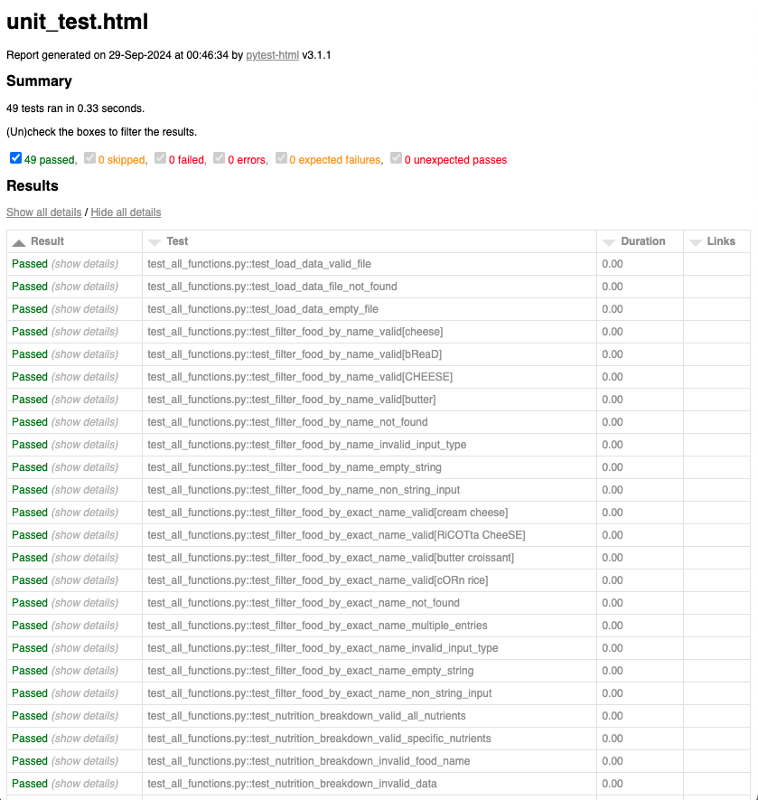

# Unit Testing Report

### GitHub Repository URL: https://github.com/Josh-Wagner1/Milestone1_Group59

---

## 1. **Test Summary**


| **Tested Functions**                   | **Test Functions**   |
| -------------------------------------- | --------------------- |
| `load_data(file_path)` | `test_load_data_valid_file()` `test_load_data_file_not_found()` `test_load_data_empty_file()` |
| `filter_food_by_name(food_name, data)` | `test_filter_food_by_name_valid()`  `test_filter_food_by_name_not_found()` `test_filter_food_by_name_invalid_input_type()` `test_filter_food_by_name_empty_string()` `test_filter_food_by_name_non_string_input()` 
|`filter_food_by_exact_name(food_name, data)`|`test_filter_food_by_exact_name_valid()` `test_filter_food_by_exact_name_not_found()` `test_filter_food_by_exact_name_multiple_entries()` `test_filter_food_by_exact_name_invalid_input_type()` `test_filter_food_by_exact_name_empty_string()` `test_filter_food_by_exact_name_non_string_input()`|
|`nutrition_breakdown(food_name, data, nutrients)`|`test_nutrition_breakdown_valid_all_nutrients()` `test_nutrition_breakdown_valid_specific_nutrients()` `test_nutrition_breakdown_invalid_food_name()` `test_nutrition_breakdown_invalid_data()` `test_nutrition_breakdown_invalid_nutrients()` `test_nutrition_breakdown_food_not_found()`|
`calculate_nutrients(food_name, data, weight_input, nutrients)`|`test_calculate_nutrients_valid()` `test_calculate_nutrients_invalid_weight()` `test_calculate_nutrients_invalid_weight_non_numeric()` `test_calculate_nutrients_food_not_found()` `test_calculate_nutrients_invalid_data()` `test_calculate_nutrients_invalid_nutrients()`|
`nutrition_range_filter(nutrient_input, nutrient_min_input, nutrient_max_input, data)`|`test_nutrition_range_filter_valid()` `test_nutrition_range_filter_invalid_nutrient()` `test_nutrition_range_filter_invalid_min_max()` `test_nutrition_range_filter_invalid_data()` `test_nutrition_range_filter_empty_nutrient_input()` `test_nutrition_range_filter_empty_column()`|
`nutrition_filter_min_max(level)`|`test_nutrition_filter_min_max_valid()` `test_nutrition_filter_min_max_invalid()` `test_nutrition_filter_min_max_empty_level()` `test_nutrition_filter_min_max_non_string()`|
`nutrition_level_filter(nutrient_input, nutrient_level, data)`|`test_nutrition_level_filter_valid()` `test_nutrition_level_filter_invalid_nutrient()` `test_nutrition_level_filter_invalid_level()` `test_nutrition_level_filter_invalid_data()` `test_nutrition_level_filter_empty_nutrient_input()` `test_nutrition_level_filter_empty_level_input()` `test_nutrition_level_filter_empty_column()`|


---

## 2. **Test Case Details**

### Test Case 1:

- **Test Function/Module**

  - `test_load_data_valid_file()`
  - `test_load_data_file_not_found()`
  - `test_load_data_empty_file(tmp_path)`
- **Tested Function/Module**
  - `load_data(file_path)`
- **Description**
  - The load_data function loads a CSV file into a DataFrame, handling errors such as missing files or empty data.
- **1) Valid Input and Expected Output**

| **Valid Input**                                      | **Expected Output**                                                        |
| ---------------------------------------------------- | -------------------------------------------------------------------------- |
| `test_load_data_valid_file()` | `DataFrame with rows loaded from CSV file` |

- **1) Code for the Test Function**

```python
    def test_load_data_valid_file():
    """Test loading data from a valid file path."""
    file_path = './Food_Nutrition_Dataset.csv'
    df = load_data(file_path)
    assert isinstance(df, pd.DataFrame), "Expected the loaded data to be a DataFrame"
    assert not df.empty, "Expected the DataFrame to be non-empty"

```

- **2) File Not Found**

| **Invalid Input**                               | **Expected Output**                                                                           |
| ----------------------------------------------- | --------------------------------------------------------------------------------------------- |
| `test_load_data_file_not_found()` | `Raises FileNotFoundError: "File not found."` |

- **2) Code for the Test Function**

```python
    def test_load_data_file_not_found():
    """Test loading data from a non-existent file."""
    file_path = './nonexistent_file.csv'
    with pytest.raises(FileNotFoundError, match="File not found."):
        load_data(file_path)
```
- **3) Empty File**


| **Invalid Input**                               | **Expected Output**                                                                           |
| ----------------------------------------------- | --------------------------------------------------------------------------------------------- |
| `test_load_data_empty_file(tmp_path)` | `Raises ValueError: "No data found in the file."` |

- **3) Code for the Test Function**

```python
    def test_load_data_empty_file(tmp_path):
    """Test loading data from an empty file."""
    empty_file = tmp_path / "empty.csv"  # Create a Path object
    empty_file.touch()  # Create an empty file
    with pytest.raises(ValueError, match="No data found in the file."):
        load_data(str(empty_file))
```

### Test Case 2:

- **Test Function/Module**

  - `test_filter_food_by_name_valid(food_data, food_name)`
  - `test_filter_food_by_name_not_found(food_data)`
  - `test_filter_food_by_name_invalid_input_type()`
  - `test_filter_food_by_name_empty_string(food_data)`
  - `test_filter_food_by_name_non_string_input(food_data)`
- **Tested Function/Module**

  - `filter_food_by_name(food_name, data)`
- **Description**

  - The `filter_food_by_name` function is designed to filter the rows in a DataFrame based on a food name. It performs a case-insensitive search for the provided `food_name` string within the `food` column of the DataFrame and returns the filtered DataFrame. It raises exceptions for invalid inputs.
- **1) Valid Input and Expected Output**

| **Valid Input**                                      | **Expected Output**                                                        |
| ---------------------------------------------------- | -------------------------------------------------------------------------- |
| `test_filter_food_by_name_valid(food_data, 'cheese)` | `DataFrame with one or more rows containing 'cheese' in the 'food' column` |

- **1) Code for the Test Function**

```python
    @pytest.mark.parametrize("food_name", [
        'cheese', 'bReaD', 'CHEESE', 'butter'
    ])
    def test_filter_food_by_name_valid(food_data, food_name):
        """Parametrized test for multiple food names."""
        result = filter_food_by_name(food_name, food_data)
        assert len(result) > 0, f"Expected at least one match for '{food_name}'"
```

- **2) Invalid Input and Expected Output**

| **Invalid Input**                               | **Expected Output**                                                                           |
| ----------------------------------------------- | --------------------------------------------------------------------------------------------- |
| `test_filter_food_by_name_not_found(food_data)` | `Raises ValueError with message: "No food item found for 'nonexistentfood' in the database."` |

- **2) Code for the Test Function**

```python
    def test_filter_food_by_name_not_found(food_data):
    """Test filtering with a food name not present."""
    with pytest.raises(ValueError, match="No food item found for 'nonexistentfood' in the database."):
        filter_food_by_name('nonexistentfood', food_data)
```
- **3) Invalid Input Type**


| **Invalid Input**                               | **Expected Output**                                                                           |
| ----------------------------------------------- | --------------------------------------------------------------------------------------------- |
| `test_filter_food_by_name_invalid_input_type()` | `Raises TypeError` |

- **3) Code for the Test Function**

```python
    def test_filter_food_by_name_invalid_input_type():
    """Test error handling for invalid data input (not a DataFrame)."""
    with pytest.raises(TypeError):
        filter_food_by_name('cheese', 'invalid_data')
```

- **4) Empty String Input**

| **Invalid Input**                               | **Expected Output**                                                                           |
| ----------------------------------------------- | --------------------------------------------------------------------------------------------- |
| `test_filter_food_by_name_empty_string(food_data)` | `Raises ValueError with message: "The food name must be a non-empty string."` |

- **4) Code for the Test Function**

```python
   def test_filter_food_by_name_empty_string(food_data):
    """Test error handling for empty string as a food name."""
    with pytest.raises(ValueError):
        filter_food_by_name('', food_data)
```

- **5) Non-String Input**


| **Invalid Input**                               | **Expected Output**                                                                           |
| ----------------------------------------------- | --------------------------------------------------------------------------------------------- |
| `test_filter_food_by_name_non_string_input(food_data)` | `Raises ValueError with message: "The food name must be a non-empty string."` |

- **5) Code for the Test Function**

```python
  def test_filter_food_by_name_non_string_input(food_data):
    """Test error handling for a non-string food name input."""
    with pytest.raises(ValueError, match="The food name must be a non-empty string."):
        filter_food_by_name(123, food_data)
```

### Test Case 3:

- **Test Function/Module**
  - `test_filter_food_by_exact_name_valid(food_data, food_name_exact)`
  - `test_filter_food_by_exact_name_not_found(food_data)`
  - `test_filter_food_by_exact_name_multiple_entries(food_data)`
  - `test_filter_food_by_exact_name_invalid_input_type()`
  - `test_filter_food_by_exact_name_empty_string(food_data)`
  - `test_filter_food_by_exact_name_non_string_input(food_data)`
- **Tested Function/Module**
  - `filter_food_by_exact_name(food_name, data)`
- **Description**
  - This function filters a DataFrame to find rows where the 'food' column matches exactly with the provided food_name. It is case-insensitive and raises exceptions for invalid input or if multiple entries are found for the same food_name.
- **1) Valid Input and Expected Output**


| **Valid Input**                                                   | **Expected Output**                                                     |
|-------------------------------------------------------------------|-------------------------------------------------------------------------|
| `test_filter_food_by_exact_name_valid(food_data, 'cream cheese')` | `DataFrame with one row containing 'cream cheese' in the 'food' column` |

- **1) Code for the Test Function**

```python
@pytest.mark.parametrize("food_name_exact", [
    'cream cheese', 'RiCOTta CheeSE', 'butter croissant', 'cORn rice'
])
def test_filter_food_by_exact_name_valid(food_data, food_name_exact):
    """Test filtering food by an exact name."""
    result = filter_food_by_exact_name(food_name_exact, food_data)
    assert not result.empty, "Expected non-empty result for exact match"
```

- **2) Invalid Input - Food Not Found**


| **Invalid Input**             | **Expected Output** |
| ----------------------------- | ------------------- |
| `test_filter_food_by_exact_name_not_found(food_data)` | `Raises ValueError with message: "No food item found for 'nonexistentfood' in the database."`  |


- **2) Code for the Test Function**

```python
def test_filter_food_by_exact_name_not_found(food_data):
    """Test filtering with a food name not present."""
    with pytest.raises(ValueError, match="No food item found for 'nonexistentfood' in the database."):
        filter_food_by_exact_name('nonexistentfood', food_data)
```

- **3) Multiple Entries Found**

| **Invalid Input**             | **Expected Output** |
| ----------------------------- | ------------------- |
| `test_filter_food_by_exact_name_multiple_entries(food_data)` | `Raises ValueError with message: "Multiple entries found for 'cream cheese'. Please provide a unique food name."`  |


- **3) Code for the Test Function**

```python
def test_filter_food_by_exact_name_multiple_entries(food_data):
    """Test handling of multiple entries with the exact same name."""
    duplicated_data = pd.concat([food_data, food_data[food_data['food'].str.lower() == 'cream cheese']])
    with pytest.raises(ValueError, match="Multiple entries found for 'cream cheese'. Please provide a unique food name."):
        filter_food_by_exact_name('cream cheese', duplicated_data)
```

- **4) Invalid Input Type**

| **Invalid Input**             | **Expected Output** |
| ----------------------------- | ------------------- |
| `test_filter_food_by_exact_name_invalid_input_type()` | `Raises TypeError`  |


- **4) Code for the Test Function**

```python
def test_filter_food_by_exact_name_invalid_input_type():
    """Test error handling for invalid data input."""
    with pytest.raises(TypeError):
        filter_food_by_exact_name('RiCOTta CheeSE', 'invalid_data')
```

- **5) Empty String Input**

| **Invalid Input**             | **Expected Output** |
| ----------------------------- | ------------------- |
| `test_filter_food_by_exact_name_empty_string(food_data)` | `Raises ValueError with message: "The food name must be a non-empty string."`  |


- **5) Code for the Test Function**

```python
def test_filter_food_by_exact_name_empty_string(food_data):
    """Test error handling for empty string as a food name."""
    with pytest.raises(ValueError):
        filter_food_by_exact_name('', food_data)
```

- **6) Non-String Input**

| **Invalid Input**             | **Expected Output** |
| ----------------------------- | ------------------- |
| `test_filter_food_by_exact_name_non_string_input(food_data)` | `Raises ValueError with message: "The food name must be a non-empty string."`  |


- **6) Code for the Test Function**

```python
def test_filter_food_by_exact_name_non_string_input(food_data):
    """Test error handling for a non-string food name input."""
    with pytest.raises(ValueError, match="The food name must be a non-empty string."):
        filter_food_by_exact_name(123, food_data)
```

### Test Case 4:

- **Test Function/Module**
  - `test_nutrition_breakdown_valid_all_nutrients(food_data)`
  - `test_nutrition_breakdown_valid_specific_nutrients(food_data)`
  - `test_nutrition_breakdown_invalid_food_name(food_data)`
  - `test_nutrition_breakdown_invalid_data()`
  - `test_nutrition_breakdown_invalid_nutrients(food_data)`
  - `test_nutrition_breakdown_food_not_found(food_data)`
- **Tested Function/Module**
  - `nutrition_breakdown(food_name, data, nutrients)`
- **Description**
  - The nutrition_breakdown function retrieves nutrient values for a specific food item from a DataFrame. It can return all nutrient information or only the nutrients specified by the nutrients parameter. It handles errors such as invalid data types, missing food items, and invalid nutrients.
  
- **1) Valid Input and Expected Output**

| **Valid Input**                                                   | **Expected Output**                                                     |
|-------------------------------------------------------------------|-------------------------------------------------------------------------|
| `test_nutrition_breakdown_valid_all_nutrients(food_data, 'cream cheese')` | `Pandas Series containing all nutrient information` |

- **1) Code for the Test Function**

```python
def test_nutrition_breakdown_valid_all_nutrients(food_data):
    """Test nutrition breakdown with a valid food name and no specified nutrients."""
    food_name = 'cream cheese'
    result = nutrition_breakdown(food_name, food_data)
    assert isinstance(result, pd.Series), "Expected the result to be a pandas Series"
    assert not result.empty, "Expected the result Series to be non-empty"
```

- **2) Valid Input - Specific Nutrients**


| **Valid Input**             | **Expected Output** |
| ----------------------------- | ------------------- |
| `test_nutrition_breakdown_valid_specific_nutrients(food_data, ['Calories', 'Protein'])` | `Pandas Series containing 'Calories' and 'Protein'`  |


- **2) Code for the Test Function**

```python
def test_nutrition_breakdown_valid_specific_nutrients(food_data):
    """Test nutrition breakdown with specific nutrients."""
    food_name = 'cream cheese'
    nutrients = ['Calories', 'Protein']
    result = nutrition_breakdown(food_name, food_data, nutrients)
    assert isinstance(result, pd.Series), "Expected the result to be a pandas Series"
    assert not result.empty, "Expected the result Series to be non-empty"
    assert all(nutrient in result.index for nutrient in nutrients), "Expected specified nutrients in the result"
```

- **3) Invalid Input - Food Name**

| **Invalid Input**             | **Expected Output** |
| ----------------------------- | ------------------- |
| `test_nutrition_breakdown_invalid_food_name(food_data)` | `Raises ValueError: "The food name must be a non-empty string."`  |


- **3) Code for the Test Function**

```python
def test_nutrition_breakdown_invalid_food_name(food_data):
    """Test nutrition breakdown with invalid food name."""
    with pytest.raises(ValueError):
        nutrition_breakdown('', food_data)
```

- **4) Invalid Data**

| **Invalid Input**             | **Expected Output** |
| ----------------------------- | ------------------- |
| `test_nutrition_breakdown_invalid_data()` | `Raises TypeError`  |


- **4) Code for the Test Function**

```python
def test_nutrition_breakdown_invalid_data():
    """Test nutrition breakdown with invalid data input."""
    with pytest.raises(TypeError):
        nutrition_breakdown('cream cheese', 'invalid_data')
```

- **5) Invalid Nutrients**

| **Invalid Input**             | **Expected Output** |
| ----------------------------- | ------------------- |
| `test_nutrition_breakdown_invalid_nutrients(food_data, ['InvalidNutrient'])` | `Empty Pandas Series`  |


- **5) Code for the Test Function**

```python
def test_nutrition_breakdown_invalid_nutrients(food_data):
    """Test nutrition breakdown with invalid nutrient names."""
    nutrients = ['InvalidNutrient']
    result = nutrition_breakdown('cream cheese', food_data, nutrients)
    assert result.empty, "Expected an empty Series for invalid nutrients"
```

- **6) Food Not Found**

| **Invalid Input**             | **Expected Output** |
| ----------------------------- | ------------------- |
| `test_nutrition_breakdown_food_not_found(food_data)` | `Empty Pandas Series`  |


- **6) Code for the Test Function**

```python
def test_nutrition_breakdown_food_not_found(food_data):
    """Test nutrition breakdown with food not found."""
    result = nutrition_breakdown('nonexistentfood', food_data)
    assert result.empty, "Expected an empty Series when food is not found"
```

### Test Case 5:

- **Test Function/Module**
  - `test_calculate_nutrients_valid(food_data)`
  - `test_calculate_nutrients_invalid_weight(food_data)`
  - `test_calculate_nutrients_invalid_weight_non_numeric(food_data)`
  - `test_calculate_nutrients_food_not_found(food_data)`
  - `test_calculate_nutrients_invalid_data()`
  - `test_calculate_nutrients_invalid_nutrients(food_data)`
- **Tested Function/Module**
  - `calculate_nutrients(food_name, data, weight_input, nutrients)`
- **Description**
  - The calculate_nutrients function calculates the nutrient values for a specified weight of a given food item. The function retrieves the nutrient breakdown and scales it according to the provided weight. It handles various errors like invalid weight, data types, and missing food items.
  
- **1) Valid Input and Expected Output**

| **Valid Input**                                                   | **Expected Output**                                                     |
|-------------------------------------------------------------------|-------------------------------------------------------------------------|
| `test_calculate_nutrients_valid(food_data, 'cream cheese', '100')` | `Pandas Series with scaled nutrient values` |

- **1) Code for the Test Function**

```python
def test_calculate_nutrients_valid(food_data):
    """Test calculate nutrients with valid inputs."""
    food_name = 'cream cheese'
    weight_input = '100'  # grams
    result = calculate_nutrients(food_name, food_data, weight_input)
    assert isinstance(result, pd.Series), "Expected the result to be a pandas Series"
    assert not result.empty, "Expected the result Series to be non-empty"
```

- **2) Invalid Weight**


| **Invalid Input**             | **Expected Output** |
| ----------------------------- | ------------------- |
| `test_calculate_nutrients_invalid_weight(food_data)` | `Empty Pandas Series`  |


- **2) Code for the Test Function**

```python
def test_calculate_nutrients_invalid_weight(food_data):
    """Test calculate nutrients with invalid weight input."""
    food_name = 'cream cheese'
    weight_input = '-100'  # Negative weight
    result = calculate_nutrients(food_name, food_data, weight_input)
    assert result.empty, "Expected an empty Series for invalid weight input"
```

- **3) Non-Numeric Weight Input**

| **Invalid Input**             | **Expected Output** |
| ----------------------------- | ------------------- |
| `test_calculate_nutrients_invalid_weight_non_numeric(food_data)` | `Empty Pandas Series`  |


- **3) Code for the Test Function**

```python
def test_calculate_nutrients_invalid_weight_non_numeric(food_data):
    """Test calculate nutrients with non-numeric weight input."""
    food_name = 'cream cheese'
    weight_input = 'abc'  # Non-numeric
    result = calculate_nutrients(food_name, food_data, weight_input)
    assert result.empty, "Expected an empty Series for non-numeric weight input"
```

- **4) Food Not Found**

| **Invalid Input**             | **Expected Output** |
| ----------------------------- | ------------------- |
| `test_calculate_nutrients_food_not_found(food_data)` | `Empty Pandas Series`  |


- **4) Code for the Test Function**

```python
def test_calculate_nutrients_food_not_found(food_data):
    """Test calculate nutrients with food not found."""
    result = calculate_nutrients('nonexistentfood', food_data, '100')
    assert result.empty, "Expected an empty Series when food is not found"
```

- **5) Invalid Data**

| **Invalid Input**             | **Expected Output** |
| ----------------------------- | ------------------- |
| `test_calculate_nutrients_invalid_data()` | `Raises TypeError`  |


- **5) Code for the Test Function**

```python
def test_calculate_nutrients_invalid_data():
    """Test calculate nutrients with invalid data input."""
    with pytest.raises(TypeError):
        calculate_nutrients('cream cheese', 'invalid_data', '100')
```

- **6) Invalid Nutrients**

| **Invalid Input**             | **Expected Output** |
| ----------------------------- | ------------------- |
| `test_calculate_nutrients_invalid_nutrients(food_data, ['InvalidNutrient'])` | `Empty Pandas Series`  |


- **6) Code for the Test Function**

```python
def test_calculate_nutrients_invalid_nutrients(food_data):
    """Test calculate nutrients with invalid nutrient names."""
    nutrients = ['InvalidNutrient']
    result = calculate_nutrients('cream cheese', food_data, '100', nutrients)
    assert result.empty, "Expected an empty Series for invalid nutrients"
```


### Test Case 6:

- **Test Function/Module**
  - `test_nutrition_range_filter_valid(food_data)`
  - `test_nutrition_range_filter_invalid_nutrient(food_data)`
  - `test_nutrition_range_filter_invalid_min_max(food_data)`
  - `test_nutrition_range_filter_invalid_data()`
  - `test_nutrition_range_filter_empty_nutrient_input(food_data)`
  - `test_nutrition_range_filter_empty_column()`
  
- **Tested Function/Module**
  - `nutrition_range_filter(nutrient_input, nutrient_min_input, nutrient_max_input, data)`
- **Description**
  - The nutrition_range_filter function filters foods based on a specified nutrient value range. It takes a nutrient name, a minimum and maximum value, and the DataFrame, and returns a list indicating which rows fall within the specified range. It raises exceptions for invalid inputs and handles missing values.
  
- **1) Valid Input and Expected Output**

| **Valid Input**                                                   | **Expected Output**                                                     |
|-------------------------------------------------------------------|-------------------------------------------------------------------------|
| `test_nutrition_range_filter_valid(food_data, 'Calories', '100', '200')` | `List of booleans indicating rows within the range` |

- **1) Code for the Test Function**

```python
def test_nutrition_range_filter_valid(food_data):
    """Test nutrition range filter with valid inputs."""
    nutrient_input = 'Calories'
    nutrient_min_input = '100'
    nutrient_max_input = '200'
    result = nutrition_range_filter(nutrient_input, nutrient_min_input, nutrient_max_input, food_data)
    assert isinstance(result, list), "Expected the result to be a list"
    assert len(result) == len(food_data), "Expected the result list to match the length of the data"
```

- **2) Invalid Nutrient**


| **Invalid Input**             | **Expected Output** |
| ----------------------------- | ------------------- |
| `test_nutrition_range_filter_invalid_nutrient(food_data)` | `List of False values indicating no matches found`  |


- **2) Code for the Test Function**

```python
def test_nutrition_range_filter_invalid_nutrient(food_data):
    """Test nutrition range filter with invalid nutrient name."""
    nutrient_input = 'InvalidNutrient'
    nutrient_min_input = '100'
    nutrient_max_input = '200'
    result = nutrition_range_filter(nutrient_input, nutrient_min_input, nutrient_max_input, food_data)
    assert all(not val for val in result), "Expected all False values when nutrient is invalid"
```

- **3) Invalid Min/Max Values**

| **Invalid Input**             | **Expected Output** |
| ----------------------------- | ------------------- |
| `test_nutrition_range_filter_invalid_min_max(food_data)` | `List of False values indicating no matches found`  |


- **3) Code for the Test Function**

```python
def test_nutrition_range_filter_invalid_min_max(food_data):
    """Test nutrition range filter with invalid min and max inputs."""
    nutrient_input = 'Calories'
    nutrient_min_input = 'abc'  # Non-numeric
    nutrient_max_input = 'def'  # Non-numeric
    result = nutrition_range_filter(nutrient_input, nutrient_min_input, nutrient_max_input, food_data)
    assert all(not val for val in result), "Expected all False values when min/max are invalid"
```

- **4) Invalid Data Type**

| **Invalid Input**             | **Expected Output** |
| ----------------------------- | ------------------- |
| `test_nutrition_range_filter_invalid_data()` | `Raises TypeError`  |


- **4) Code for the Test Function**

```python
def test_nutrition_range_filter_invalid_data():
    """Test nutrition range filter with invalid data input."""
    with pytest.raises(TypeError):
        nutrition_range_filter('Calories', '100', '200', 'invalid_data')
```

- **5) Empty Nutrient Input**

| **Invalid Input**             | **Expected Output** |
| ----------------------------- | ------------------- |
| `test_nutrition_range_filter_empty_nutrient_input(food_data)` | `Raises ValueError: "The nutrient name must be a non-empty string."`  |


- **5) Code for the Test Function**

```python
def test_calculate_nutrients_invalid_data():
    """Test calculate nutrients with invalid data input."""
    with pytest.raises(TypeError):
        calculate_nutrients('cream cheese', 'invalid_data', '100')
```

- **6) Invalid Nutrients**

| **Invalid Input**             | **Expected Output** |
| ----------------------------- | ------------------- |
| `test_calculate_nutrients_invalid_nutrients(food_data, ['InvalidNutrient'])` | `Empty Pandas Series`  |


- **6) Code for the Test Function**

```python
def test_nutrition_range_filter_empty_nutrient_input(food_data):
    """Test nutrition range filter with empty nutrient input."""
    nutrient_input = ''
    nutrient_min_input = '100'
    nutrient_max_input = '200'
    with pytest.raises(ValueError, match="The nutrient name must be a non-empty string."):
        nutrition_range_filter(nutrient_input, nutrient_min_input, nutrient_max_input, food_data)

```

- **6) Empty Column**

| **Invalid Input**             | **Expected Output** |
| ----------------------------- | ------------------- |
| `test_nutrition_range_filter_empty_column()` | `Empty Pandas Series`  |


- **6) Code for the Test Function**

```python
def test_nutrition_range_filter_empty_column():
    """Test nutrition range filter with empty min/max inputs."""
    nutrient_input = 'Fat'
    nutrient_min_input = '150'
    nutrient_max_input = '200'
    data = {'Fat': []}
    result = nutrition_range_filter(nutrient_input, nutrient_min_input, nutrient_max_input, pd.DataFrame(data))
    assert len(result) == 0, "Expected an empty Series for invalid nutrients"

```

### Test Case 7:

- **Test Function/Module**
  - `test_nutrition_filter_min_max_valid()`
  - `test_nutrition_filter_min_max_invalid()`
  - `test_nutrition_filter_min_max_empty_level()`
  - `test_nutrition_filter_min_max_non_string()`
  
- **Tested Function/Module**
  - `nutrition_filter_min_max(level)`
- **Description**
  - The nutrition_filter_min_max function returns the minimum and maximum percentage values corresponding to a nutrient level (low, medium, high). It handles invalid level input by raising a ValueError or returning default values.

  
- **1) Valid Input and Expected Output**

| **Valid Input**                                                   | **Expected Output**                                                     |
|-------------------------------------------------------------------|-------------------------------------------------------------------------|
| `test_nutrition_filter_min_max_valid()` | `Correct min and max values for 'low', 'medium', 'high'` |

- **1) Code for the Test Function**

```python
def test_nutrition_filter_min_max_valid():
    """Test nutrition filter min max with valid level inputs."""
    levels = {'low': (0, 33), 'medium': (33, 66), 'high': (66, 100)}
    for level, expected in levels.items():
        p_low, p_high = nutrition_filter_min_max(level)
        assert (p_low, p_high) == expected, f"Expected {expected} for level '{level}'"
```

- **2) Invalid Level Input**


| **Invalid Input**             | **Expected Output** |
| ----------------------------- | ------------------- |
| `test_nutrition_filter_min_max_invalid()` | `Default values (0, 0) and error message`  |


- **2) Code for the Test Function**

```python
def test_nutrition_filter_min_max_invalid():
    """Test nutrition filter min max with invalid level input."""
    level = 'invalid_level'
    p_low, p_high = nutrition_filter_min_max(level)
    assert (p_low, p_high) == (0, 0), "Expected (0, 0) when level is invalid"
```

- **3) Empty Level Input**

| **Invalid Input**             | **Expected Output** |
| ----------------------------- | ------------------- |
| `test_nutrition_filter_min_max_empty_level()` | `Default values (0, 0)`  |


- **3) Code for the Test Function**

```python
def test_nutrition_filter_min_max_empty_level():
    """Test nutrition filter min max with empty level input."""
    level = ''
    p_low, p_high = nutrition_filter_min_max(level)
    assert (p_low, p_high) == (0, 0), "Expected (0, 0) when level is empty"
```

- **4) Non-String Level Input**

| **Invalid Input**             | **Expected Output** |
| ----------------------------- | ------------------- |
| `test_nutrition_filter_min_max_non_string()` | `Default values (0, 0)`  |


- **4) Code for the Test Function**

```python
def test_nutrition_filter_min_max_non_string():
    """Test nutrition filter min max with non-string level input."""
    level = 123
    p_low, p_high = nutrition_filter_min_max(level)
    assert (p_low, p_high) == (0, 0), "Expected (0, 0) when level is non-string"
```

### Test Case 8:

- **Test Function/Module**
  - `test_nutrition_level_filter_valid(food_data)`
  - `test_nutrition_level_filter_invalid_nutrient(food_data)`
  - `test_nutrition_level_filter_invalid_level(food_data)`
  - `test_nutrition_level_filter_invalid_data()`
  - `test_nutrition_level_filter_empty_nutrient_input(food_data)`
  - `test_nutrition_level_filter_empty_level_input(food_data)`
  - `test_nutrition_level_filter_empty_column()`
  
- **Tested Function/Module**
  - `nutrition_level_filter(nutrient_input, nutrient_level, data)`
- **Description**
  - The nutrition_level_filter function filters foods based on whether the nutrient values fall within predefined levels (low, medium, high). It returns a list of booleans indicating which foods match the specified level. The function handles invalid input gracefully.
  
- **1) Valid Input and Expected Output**

| **Valid Input**                                                   | **Expected Output**                                                     |
|-------------------------------------------------------------------|-------------------------------------------------------------------------|
| `test_nutrition_level_filter_valid(food_data, 'Calories', 'low')` | `List of booleans indicating rows within the level range` |

- **1) Code for the Test Function**

```python
def test_nutrition_level_filter_valid(food_data):
    """Test nutrition level filter with valid inputs."""
    nutrient_input = 'Calories'
    nutrient_level = 'low'
    result = nutrition_level_filter(nutrient_input, nutrient_level, food_data)
    assert isinstance(result, list), "Expected the result to be a list"
    assert len(result) == len(food_data), "Expected the result list to match the length of the data"
```

- **2) Invalid Nutrient**


| **Invalid Input**             | **Expected Output** |
| ----------------------------- | ------------------- |
| `test_nutrition_level_filter_invalid_nutrient(food_data)` | `List of False values indicating no matches found`  |


- **2) Code for the Test Function**

```python
def test_nutrition_level_filter_invalid_nutrient(food_data):
    """Test nutrition level filter with invalid nutrient name."""
    nutrient_input = 'InvalidNutrient'
    nutrient_level = 'low'
    result = nutrition_level_filter(nutrient_input, nutrient_level, food_data)
    assert all(not val for val in result), "Expected all False values when nutrient is invalid"
```

- **3)  Invalid Level**

| **Invalid Input**             | **Expected Output** |
| ----------------------------- | ------------------- |
| `test_nutrition_level_filter_invalid_level(food_data)` | `List of False values indicating no matches found`  |


- **3) Code for the Test Function**

```python
def test_nutrition_level_filter_invalid_level(food_data):
    """Test nutrition level filter with invalid level input."""
    nutrient_input = 'Calories'
    nutrient_level = 'invalid_level'
    result = nutrition_level_filter(nutrient_input, nutrient_level, food_data)
    assert all(not val for val in result), "Expected all False values when level is invalid"
```

- **4) Invalid Data**

| **Invalid Input**             | **Expected Output** |
| ----------------------------- | ------------------- |
| `test_nutrition_level_filter_invalid_data()` | `Raises TypeError`  |


- **4) Code for the Test Function**

```python
def test_nutrition_level_filter_invalid_data():
    """Test nutrition level filter with invalid data input."""
    with pytest.raises(TypeError):
        nutrition_level_filter('Calories', 'low', 'invalid_data')
```

- **5) Empty Nutrient Input**

| **Invalid Input**             | **Expected Output** |
| ----------------------------- | ------------------- |
| `test_nutrition_level_filter_empty_nutrient_input(food_data)` | `Raises ValueError: "The nutrient must be a non-empty string."`  |


- **5) Code for the Test Function**

```python
def test_nutrition_level_filter_empty_nutrient_input(food_data):
    """Test nutrition level filter with empty nutrient input."""
    nutrient_input = ''
    nutrient_level = 'low'
    with pytest.raises(ValueError, match="The nutrient must be a non-empty string."):
        nutrition_level_filter(nutrient_input, nutrient_level, food_data)
```

- **6) Empty Level Input**

| **Invalid Input**             | **Expected Output** |
| ----------------------------- | ------------------- |
| `test_nutrition_level_filter_empty_level_input(food_data)` | `Raises ValueError: "The nutrient level must be a non-empty string."`  |


- **6) Code for the Test Function**

```python
def test_nutrition_level_filter_empty_level_input(food_data):
    """Test nutrition level filter with empty level input."""
    nutrient_input = 'Calories'
    nutrient_level = ''
    with pytest.raises(ValueError, match="The nutrient level must be a non-empty string."):
```

- **7) Empty Column**

| **Invalid Input**             | **Expected Output** |
| ----------------------------- | ------------------- |
| `test_nutrition_level_filter_empty_column()` | `Empty Pandas Series`  |


- **7) Code for the Test Function**

```python
def test_nutrition_range_filter_empty_column():
    """Test nutrition range filter with empty min/max inputs."""
    nutrient_input = 'Fat'
    nutrient_level = 'low'
    data = {'Fat': []}
    result = nutrition_level_filter(nutrient_input, nutrient_level, pd.DataFrame(data))
    assert len(result) == 0, "Expected an empty Series for invalid nutrients"
```

## 3. **Testing Report Summary**


